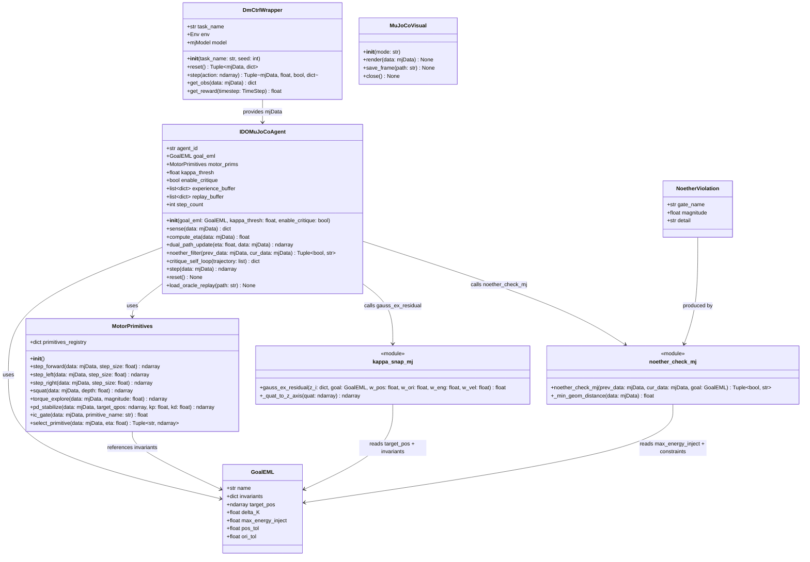
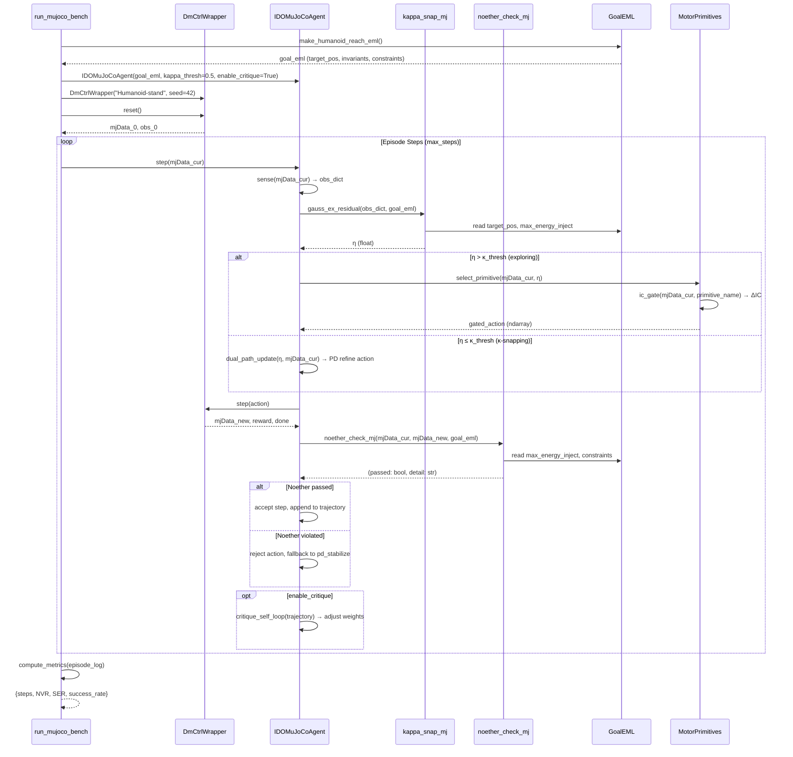
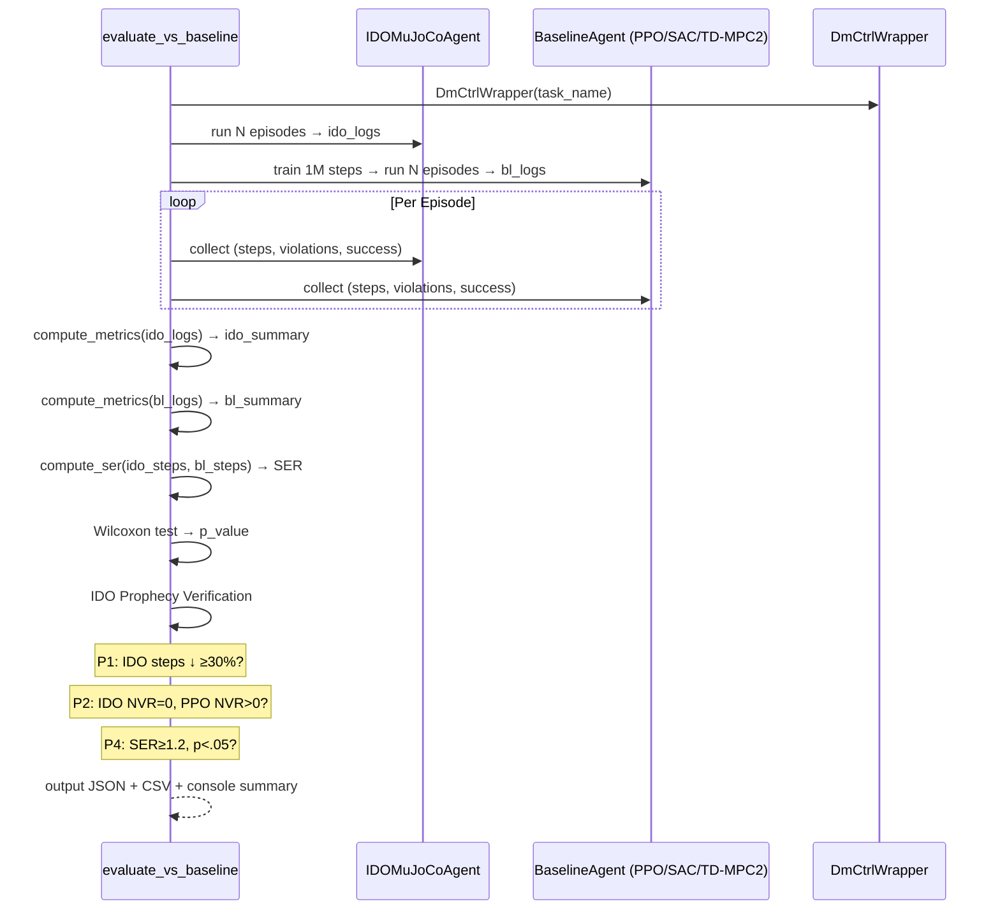
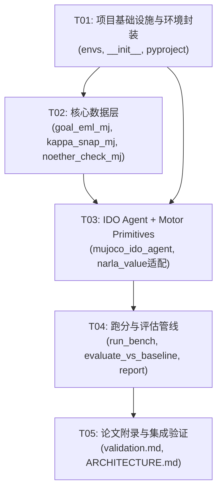
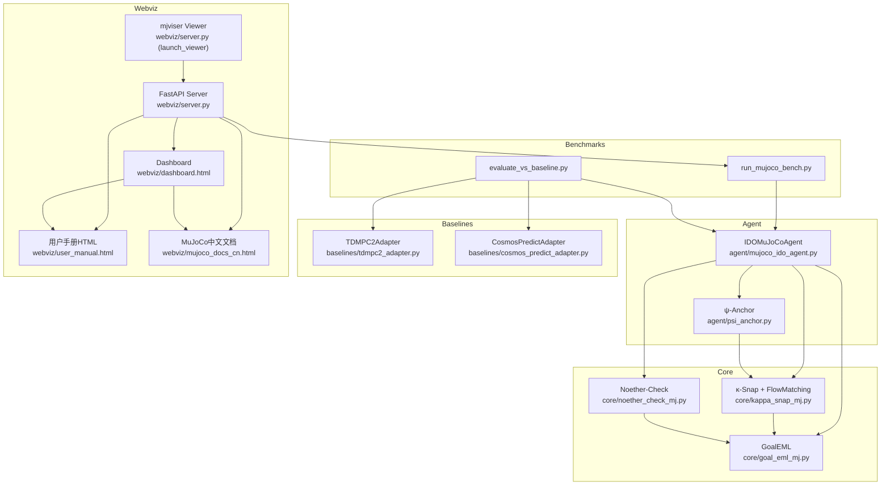

# MuJoCo-Bench-IDO 系统架构设计

> **架构师**: 高见远（Gao） — Architect  
> **日期**: 2025-07-01  
> **版本**: v1.0  

---

## Part A: System Design

### 1. Implementation Approach

#### 1.1 核心技术挑战

| # | 挑战 | 分析 | 解决策略 |
|---|------|------|----------|
| C1 | **连续状态映射** | ARC 的 Inflow 是离散像素网格，MuJoCo 的 Inflow 是连续 mjData（qpos/qvel/sensor），维度与量纲混杂 | 定义统一的 `sense()` 方法，将 mjData 各字段提取为标准化 `obs_dict`，加权组合为 η |
| C2 | **η 量纲归一化** | 位置(m)、角度(rad)、能量(J)、速度(m/s) 量纲不同，平方距 η 可能偏置 | `gauss_ex_residual` 采用可调权重 (w_pos, w_ori, w_eng, w_vel)，并支持 per-task 归一化系数；权重默认值已在代码骨架中给出 |
| C3 | **Noether 能量校验边界** | MuJoCo 接触力产生耗散，ΔE 的 "external work" 界定模糊 | 第一版采用保守策略：`ΔE ≤ max_energy_inject`（GoalEML 定义），不计碰撞耗散；碰撞单独由 `_min_geom_distance` 门控 |
| C4 | **Motor Primitive 与 IC 门控** | 原有 NARLA tile macro 是离散符号组合，连续域需参数化元动作 | 内嵌 `MotorPrimitives` 类，5 个元动作 + `pd_stabilize`，IC_Value_Score=ΔIC 门控决定是否执行或降级为 PD 探索 |
| C5 | **Baseline 公平对比** | PPO/SAC/TD-MPC2 训练预算与超参需统一 | `evaluate_vs_baseline.py` 提供 `register_baseline` decorator，统一 episode 数与 max_steps，baseline 使用 SB3 默认超参 + 1M step 训练预算 |

#### 1.2 框架与库选型

| 库 | 版本 | 用途 | 选型理由 |
|----|------|------|----------|
| `dm_control` | ≥1.0.0 | MuJoCo 环境封装 | dm_control 是 DeepMind 官方 MuJoCo Python wrapper，提供标准任务 suite（Humanoid, Hopper, Walker, Reacher），是学术基准主流 |
| `mujoco` | ≥2.3.0 | 物理引擎底层 | dm_control 的底层依赖，直接访问 `mjData`/`mjModel` |
| `numpy` | ≥1.24.0 | 数值计算 | η 计算、向量运算、矩阵操作 |
| `stable_baselines3` | ≥2.0.0 (可选) | PPO/SAC baseline | SB3 是 RL baseline 标准库，PPO/SAC 实现成熟，`evaluate_vs_baseline.py` 可直接调用 |
| `tdmpc2` | ≥1.0.0 (可选) | TD-MPC2 baseline | 论文对比所需的 model-based baseline |
| `dataclasses` | 标准库 | 数据结构定义 | GoalEML, NoetherViolation 等结构体 |

#### 1.3 架构模式

本项目为 **模块化管线架构**（Modular Pipeline），不采用 MVC/MVVM（无 GUI）。核心模式为：

- **Strategy Pattern**: GoalEML 定义任务策略，`make_*_eml()` factory 函数产出不同任务配置
- **Pipeline Pattern**: IDO Harness 五环节串行管线：Sense → κ-Snap → Dual-Path → Noether → Critique
- **Decorator Pattern**: `register_baseline` 允许第三方注册新 baseline
- **State Machine**: Agent 每步在 `(exploring / κ-snapping / noether-pruning / critiquing)` 状态间切换

---

### 2. File List

| # | 相对路径 | 类型 | 说明 |
|---|---------|------|------|
| 1 | `agent/mujoco_ido_agent.py` | ★ 新 | IDO MuJoCo Agent 核心类 + 内嵌 MotorPrimitives |
| 2 | `core/kappa_snap_mj.py` | ★ 新 | 连续 GaussEx 残差计算 |
| 3 | `core/noether_check_mj.py` | ★ 新 | 物理 Noether-Check 三重门 |
| 4 | `core/goal_eml_mj.py` | ★ 新 | Goal-EML 物理任务定义 + factory |
| 5 | `benchmarks/run_mujoco_bench.py` | ★ 新 | 一键跑分 CLI 脚本 |
| 6 | `benchmarks/evaluate_vs_baseline.py` | ★ 新 | IDO vs Baseline 对比评估 |
| 7 | `papers/mujoco_bench_ido_validation.md` | ★ 新 | 论文 Appendix C |
| 8 | `envs/dmctrl_wrapper.py` | ★ 新 | dm_control 环境统一封装（提取 obs/action/reward） |
| 9 | `envs/mujoco_visual.py` | ★ 新 | MuJoCo 可视化工具（可选渲染 + 录屏） |
| 10 | `benchmarks/report_ido_advantage.py` | ★ 新 | 结果汇总与 LaTeX 表格生成 |
| 11 | `agent/__init__.py` | ★ 新(更新) | 添加 mujoco_ido_agent 导出 |
| 12 | `core/__init__.py` | ★ 新(更新) | 添加 mj 模块导出 |
| 13 | `benchmarks/__init__.py` | ★ 新 | 包初始化 |
| 14 | `envs/__init__.py` | ★ 新 | 包初始化 |
| 15 | `benchmarks/results/.gitkeep` | ★ 新 | 结果输出目录占位 |

**不变的已有文件**：`agent/my_agent.py`, `core/kappa_snap.py`, `core/noether_check.py`, `core/goal_eml.py`, `core/narla_value.py`, `reference_notebooks/`, `papers/`（原有内容）

---

### 3. Data Structures and Interfaces



#### 关键接口详述

**`IDOMuJoCoAgent.sense(data: mjData) → dict`**

```python
def sense(self, data: mjData) -> dict:
    """从 mjData 提取标准化观测字典"""
    return {
        'qpos': np.array(data.qpos),          # 位置/角度
        'qvel': np.array(data.qvel),          # 速度
        'actuator_force': np.array(data.actuator_force),  # 执行器力
        'sensor_data': np.array(data.sensordata),         # 传感器
        'ee_pos': self._get_ee_pos(data),     # 末端执行器位置
        'ee_quat': self._get_ee_quat(data),   # 末端执行器姿态
        'energy': self._compute_energy(data), # 系统动能+势能
    }
```

**`kappa_snap_mj.gauss_ex_residual() → float`**

```python
def gauss_ex_residual(z_i: dict, goal: GoalEML,
                      w_pos=1.0, w_ori=0.3, w_eng=0.01, w_vel=0.05) -> float:
    """η = w_pos·‖ee−target‖² + w_ori·tilt² + w_eng·max(0,E−E_budget)² + w_vel·‖v_ee‖²"""
    pos_err = np.linalg.norm(z_i['ee_pos'] - goal.target_pos)
    z_axis = _quat_to_z_axis(z_i['ee_quat'])
    tilt = np.linalg.norm(z_axis - np.array([0, 0, 1]))
    energy_err = max(0, z_i['energy'] - goal.max_energy_inject)
    vel_err = np.linalg.norm(z_i['ee_vel'] if 'ee_vel' in z_i else z_i['qvel'][:3])
    return w_pos * pos_err**2 + w_ori * tilt**2 + w_eng * energy_err**2 + w_vel * vel_err**2
```

**`noether_check_mj.noether_check_mj() → Tuple[bool, str]`**

```python
def noether_check_mj(prev_data, cur_data, goal: GoalEML) -> Tuple[bool, str]:
    """三重守恒门：能量漂移 / 力矩限幅 / 自碰撞"""
    violations = []
    # Gate 1: Energy drift
    delta_E = cur_energy - prev_energy
    if delta_E > goal.max_energy_inject + ENERGY_TOLERANCE:
        violations.append(NoetherViolation("energy_drift", delta_E, ...))
    # Gate 2: Torque limit
    if np.any(np.abs(cur_data.actuator_force) > torque_limits + TORQUE_TOLERANCE):
        violations.append(NoetherViolation("torque_exceed", ...))
    # Gate 3: Self-collision
    min_dist = _min_geom_distance(cur_data)
    if min_dist < COLLISION_THRESHOLD:
        violations.append(NoetherViolation("self_collision", min_dist, ...))
    passed = len(violations) == 0
    detail = "; ".join(v.gate_name for v in violations) if violations else "OK"
    return (passed, detail)
```

**`GoalEML factory functions`**

```python
@dataclass
class GoalEML:
    name: str
    invariants: dict          # e.g. {'contact': ['feet_on_ground']}
    target_pos: np.ndarray    # target end-effector / body position
    delta_K: float            # allowed kinetic energy variation
    max_energy_inject: float  # max energy injection per step
    pos_tol: float            # position tolerance (m)
    ori_tol: float            # orientation tolerance (rad)

def make_humanoid_reach_eml() -> GoalEML: ...
def make_hopper_stand_eml() -> GoalEML: ...
def make_walker_run_eml() -> GoalEML: ...
def make_reacher_easy_eml() -> GoalEML: ...
```

**`DmCtrlWrapper`**

```python
class DmCtrlWrapper:
    """dm_control 环境统一封装"""
    def __init__(self, task_name: str, seed: int = 0):
        self.env = _import_env(task_name)(random=seed)
        self.model = self.env.physics.model
    
    def get_obs(self, data) -> dict:
        """提取 qpos/qvel/sensor/ee_pos/ee_quat/energy"""
        ...
```

---

### 4. Program Call Flow



#### Baseline 对比评估流程



---

### 5. Anything UNCLEAR

| # | 问题 | 当前假设 | 建议 |
|---|------|----------|------|
| U1 | **Goal-EML 陪集粒度**：各任务的 invariants 与 target_pos 精确值 | 默认值由 factory 函数硬编码（参考 dm_control reward 定义），pos_tol=0.05m, ori_tol=0.1rad | 需实验校准，factory 函数支持参数覆盖 |
| U2 | **η 归一化系数**：各任务 η 的权重 w_pos/w_ori/w_eng/w_vel | 使用代码骨架默认值 (1.0/0.3/0.01/0.05)，不做额外归一化 | 实验后可能需要 per-task 调权；架构预留 `GoalEML.invariants['weights']` 字段 |
| U3 | **Noether 能量校验边界**：碰撞耗散是否计入 external work | 保守策略：不计碰撞耗散，仅校验 `ΔE ≤ max_energy_inject` | 第一版简化，后续可增加 `contact_energy_loss` 项 |
| U4 | **Baseline 训练预算**：PPO/SAC/TD-MPC2 的超参与训练量 | SB3 默认超参 + 1M step 训练，dm_control 标准 reward | 可通过 `register_baseline` 的 `train_config` 参数调整 |
| U5 | **MotorPrimitives 与 Expert Replay 依赖关系**：是否为 P0 必需 | MotorPrimitives 内嵌于 Agent（P0），Expert Replay 为 P1 可选 | Expert Replay 缺失时 Agent 用 `pd_stabilize` 替代初始化 |
| U6 | **narla_value.py 复用方式**：IC_Value_Score=ΔIC 如何在连续域计算 | 复用原有 narla_value.py 的 ΔIC 计算，输入从离散 grid 改为连续 obs_dict | 需确认 narla_value.py 的接口是否可接受连续输入 |

---

## Part B: Task Decomposition

### 6. Required Packages

```
- dm_control@>=1.0.0: MuJoCo 环境封装（DeepMind 官方 wrapper）
- mujoco@>=2.3.0: 物理引擎底层
- numpy@>=1.24.0: 数值计算核心
- dataclasses: 标准库（GoalEML, NoetherViolation 定义）
- argparse: 标准库（CLI 参数解析）
- json: 标准库（结果输出）
- csv: 标准库（CSV 输出）
- scipy@>=1.10.0: 统计检验（Wilcoxon, t-test）
- stable_baselines3@>=2.0.0 (可选): PPO/SAC baseline 实现
- tdmpc2@>=1.0.0 (可选): TD-MPC2 baseline 实现
```

### 7. Task List (ordered by dependency)

| Task ID | Task Name | Source Files | Dependencies | Priority |
|---------|-----------|-------------|--------------|----------|
| T01 | **项目基础设施与环境封装** | `envs/__init__.py`, `envs/dmctrl_wrapper.py`, `envs/mujoco_visual.py`, `benchmarks/__init__.py`, `benchmarks/results/.gitkeep`, `agent/__init__.py`(更新), `core/__init__.py`(更新), `pyproject.toml`(更新依赖) | 无 | P0 |
| T02 | **核心数据层（Goal-EML + κ-Snap + Noether-Check）** | `core/goal_eml_mj.py`, `core/kappa_snap_mj.py`, `core/noether_check_mj.py` | T01 | P0 |
| T03 | **IDO Agent + Motor Primitives** | `agent/mujoco_ido_agent.py`, `core/narla_value.py`(复用适配), `envs/dmctrl_wrapper.py`(集成测试) | T02 | P0 |
| T04 | **跑分与评估管线** | `benchmarks/run_mujoco_bench.py`, `benchmarks/evaluate_vs_baseline.py`, `benchmarks/report_ido_advantage.py` | T03 | P1 |
| T05 | **论文附录与集成验证** | `papers/mujoco_bench_ido_validation.md`, `ARCHITECTURE.md`(追加), 全项目集成联调 | T04 | P2 |

#### Task 详情

**T01: 项目基础设施与环境封装**

- 创建 `envs/` 子包与 `benchmarks/` 子包的 `__init__.py`
- 实现 `DmCtrlWrapper`：统一加载 dm_control 环境，封装 `reset()`/`step()`/`get_obs()`/`get_reward()`，为 Agent 和 Benchmark 提供标准化接口
- 实现 `MuJoCoVisual`：可选渲染与帧保存，用于 debug 和论文素材
- 更新 `pyproject.toml` 添加 dm_control/mujoco/numpy/scipy 等依赖
- 更新 `agent/__init__.py` 和 `core/__init__.py` 添加 mj 模块导出

**T02: 核心数据层（Goal-EML + κ-Snap + Noether-Check）**

- 实现 `GoalEML` dataclass 与 4 个 factory 函数（`make_humanoid_reach_eml`, `make_hopper_stand_eml`, `make_walker_run_eml`, `make_reacher_easy_eml`）
- 实现 `gauss_ex_residual()`：加权平方距 η 计算 + `_quat_to_z_axis()` 辅助
- 实现 `noether_check_mj()`：三重守恒门（能量漂移/力矩限幅/自碰撞）+ `NoetherViolation` dataclass + `_min_geom_distance()` 辅助
- 单元测试验证各模块独立正确性

**T03: IDO Agent + Motor Primitives**

- 实现 `IDOMuJoCoAgent` 类：sense → compute_eta → dual_path_update → noether_filter → critique_self_loop 五环节循环
- 内嵌 `MotorPrimitives` 类：5 个元动作 + `pd_stabilize` + `ic_gate` + `select_primitive`
- 复用/适配 `core/narla_value.py` 的 ΔIC 计算接口
- 集成测试：Agent + DmCtrlWrapper 在至少 1 个 dm_control 任务上跑通完整 episode

**T04: 跑分与评估管线**

- 实现 `run_mujoco_bench.py`：TASK_REGISTRY, `_import_env()`, `run_single_episode()`, `run_benchmark()`, argparse CLI
- 实现 `evaluate_vs_baseline.py`：BASELINE_REGISTRY, `register_baseline` decorator, `compute_metrics()`, `compute_ser()`, `run_evaluation()`, IDO Prophecy Verification, JSON + CSV 输出
- 实现 `report_ido_advantage.py`：汇总结果生成 LaTeX 表格与 console summary
- 在 4 个标准任务上运行 IDO，确认跑分脚本可用

**T05: 论文附录与集成验证**

- 撰写 `papers/mujoco_bench_ido_validation.md`：完整实验结果、预言验证分析、方法论描述
- 追加 `ARCHITECTURE.md` MuJoCo-Bench-IDO 章节
- 全项目集成联调：确认 IDO Agent + 跑分 + 评估 + 可视化全链路可用
- 最终验证：IDO 在 ≥3 个任务上 P1/P2/P4 预言通过

### 8. Shared Knowledge

```
- 所有 mjData 提取的 obs_dict 格式统一：{'qpos', 'qvel', 'actuator_force', 'sensor_data', 'ee_pos', 'ee_quat', 'energy'}
- η 计算默认权重：w_pos=1.0, w_ori=0.3, w_eng=0.01, w_vel=0.05，可通过 GoalEML.invariants['weights'] 覆盖
- Noether-Check 容差：ENERGY_TOLERANCE=0.1J, TORQUE_TOLERANCE=0.05*N·m, COLLISION_THRESHOLD=0.01m
- 所有 baseline 统一训练预算：1M steps，SB3 默认超参
- 评估输出格式：JSON {task, agent, episodes, metrics: {steps, NVR, SER, success_rate}}
- 日期时间存储格式：ISO 8601 UTC
- GoalEML factory 函数参数可覆盖：make_*_eml(**kwargs) 支持自定义 target_pos/tol
- motor primitive action 输出维度与 dm_control env.action_spec() 一致
- Critique self-loop 仅在 enable_critique=True 时激活，默认 False
```

### 9. Task Dependency Graph



---

### v0.3.0 新增模块（Baseline集成 + Web可视化）

#### baselines/ 目录

| 文件 | 类型 | 说明 |
|------|------|------|
| `baselines/__init__.py` | ★ 新 | 包初始化 |
| `baselines/tdmpc2_adapter.py` | ★ 新 | TD-MPC2 v2 baseline adapter（model-based RL控制对比） |
| `baselines/cosmos_predict_adapter.py` | ★ 新 | Cosmos-Predict世界模型adapter（η轨迹预测对比） |

**TDMPC2Adapter**：
- 统一接口：choose_action(obs), evaluate(n_episodes), reset()
- 任务名映射：humanoid-stand → humanoid_stand, 等
- 模型尺寸：1M/5M/19M/48M/317M参数
- 注册为"tdmpc2_v2"在BASELINE_REGISTRY
- 优雅降级：tdmpc2未安装时返回None

**CosmosPredictAdapter**：
- 世界模型baseline（非控制agent）——η轨迹预测对比
- 模型变体：7B/14B video2world, 7B token2world
- 注册为"cosmos-predict"在BASELINE_REGISTRY
- 需GPU + CUDA（7B-14B参数模型）
- 优雅降级：未安装时跳过

#### webviz/ 目录

| 文件 | 类型 | 说明 |
|------|------|------|
| `webviz/__init__.py` | ★ 新 | 包初始化 |
| `webviz/server.py` | ★ 新(v0.3.0修复) | FastAPI REST API + WebSocket + mjviser服务 |
| `webviz/dashboard.html` | ★ 新 | 实时监控仪表盘HTML（Chart.js + WebSocket） |
| `webviz/user_manual.html` | ★ 新(v0.3.0) | 用户手册HTML版本（从Markdown转换，深色主题单文件，左侧目录导航） |
| `webviz/mujoco_docs_cn.html` | ★ 新(v0.3.0) | MuJoCo官方文档Overview中文翻译版（深色主题单文件，左侧目录导航） |
| `webviz/run_webviz.py` | ★ 新 | uvicorn启动脚本 |

**server.py v0.3.0 mjviser Bug修复**：
- Bug A：Viewer.__init__不接受port参数 → 先创建ViserServer(port=8081)
- Bug B：env.model不存在 → env.physics.model._model
- Bug C：缺少data参数 → env.physics.data._data

**评估模式**：

| 模式 | CLI参数 | 对比内容 |
|------|---------|----------|
| control | --eval-mode control | IDO vs TD-MPC2/PPO/SAC（步数, NVR, SER） |
| cosmos-predict | --eval-mode cosmos-predict | IDO FlowMatching η vs Cosmos-Predict η轨迹 |

#### v0.3.0 模块关系图



---

*Document by 高见远（Gao） — Architect*  
*Date: 2025-07-01*  
*v0.3.0 update: 2025-07-01*
