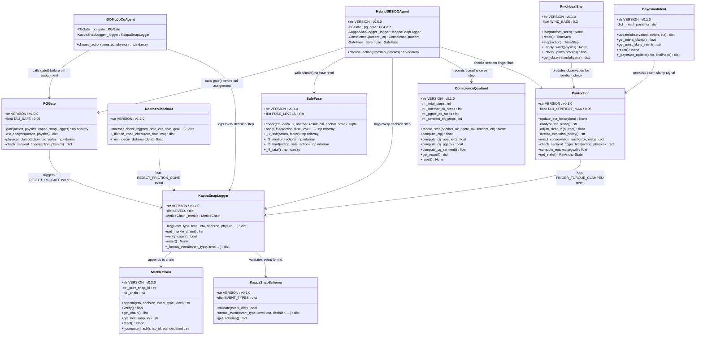
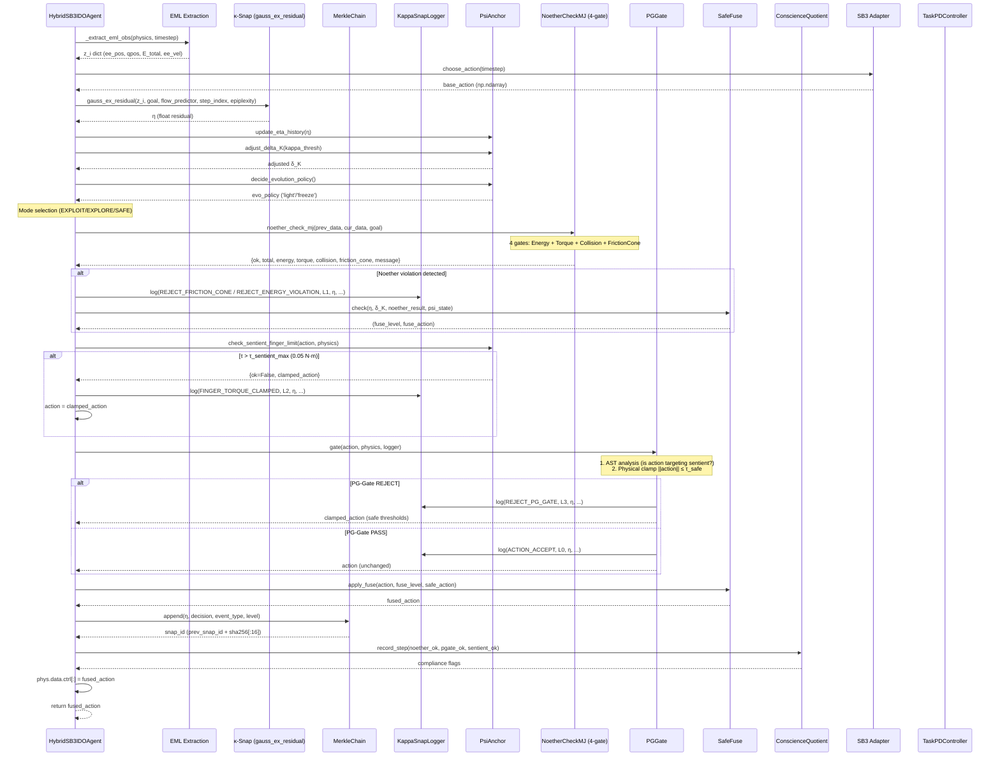
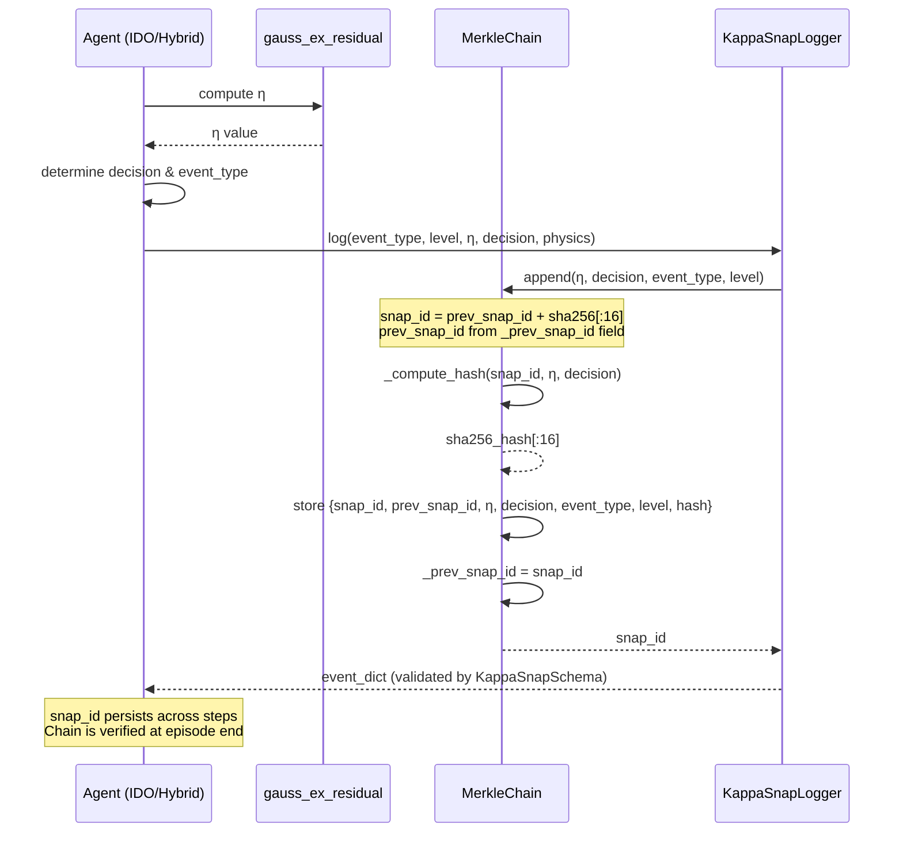
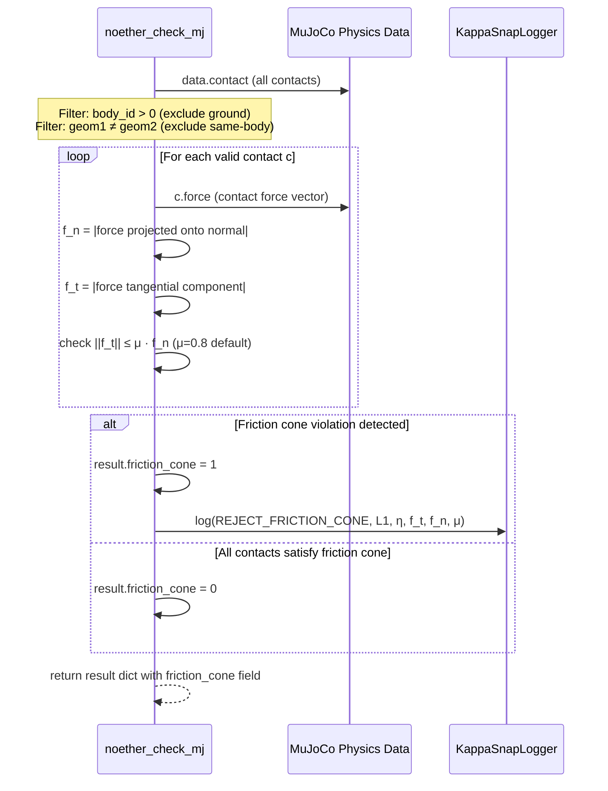
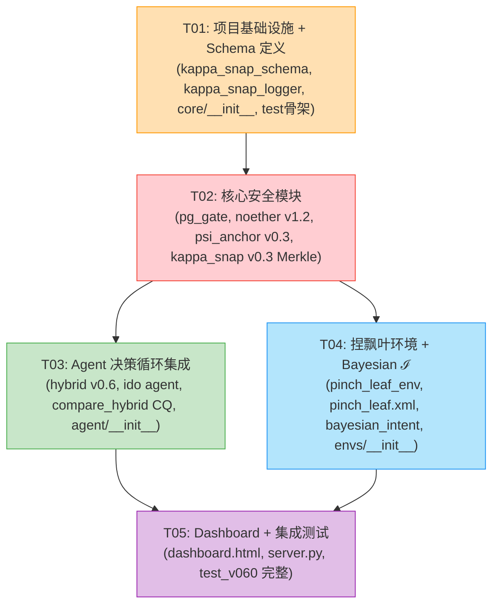

# MuJoCo-Bench-IDO v0.6.0 — System Design Document

> **框架定位升级**: 从"物理守恒校验框架" → "机器良知审计框架"
> **版本**: v0.6.0 | **作者**: 架构师高见远（Gao） | **日期**: 2026-07-02

---

## Part A: System Design

### 1. Implementation Approach

#### 1.1 Core Technical Challenges

| # | 挑战 | 难度 | 解决策略 |
|---|------|------|----------|
| C1 | PG-Gate 在 action 下发前拦截，不能被 Reward 覆盖 | ★★★ | 在 `choose_action()` 最后一步执行 PG-Gate 硬钳位，位于 Noether post-check 之后、`phys.data.ctrl[:] = action` 之前 |
| C2 | κ-Snap Merkle 链需要与现有 `gauss_ex_residual()` 集成 | ★★★ | η 计算完成后自动记录到 MerkleChain，prev_snap_id 通过 agent 内部状态传递 |
| C3 | Noether 摩擦锥需要从 MuJoCo contact force 获取 | ★★★ | 使用 `physics.data.contact[].force` 矢量 + `physics.model.geom_bodyid` 过滤非地面接触 |
| C4 | CQ 三个子维度需要从 noether/pg_gate/psi_anchor 输出中统一聚合 | ★★ | 定义 `ConscienceQuotient` 类，每步从各模块 `ok/violation` 状态提取合规计数 |
| C5 | "捏飘叶" 需要自定义 MuJoCo XML 模型（手指+叶片+风场） | ★★★★ | 基于 dm_control `manipulation` 域扩展，自定义 MJCF XML + `dm_control.Environment` |
| C6 | 安全熔断 L1-L4 需要在 HybridSB3IDOAgent 内实现层级降级 | ★★ | 在 `_modulate_action()` 中插入熔断逻辑，优先级: PG-Gate > 熔断 > Creative-Probe |

#### 1.2 Framework & Library Selections

| 模块 | 选型 | 理由 |
|------|------|------|
| 物理引擎 | dm_control + MuJoCo | 已有生态，contact force API 可用 |
| 数值计算 | numpy | 已有依赖，Merkle 哈希用 hashlib |
| 哈希 | hashlib (sha256) | 标准库，Merkle 链校验 |
| JSON Schema | jsonschema | κ-Snap 18 种事件类型验证 |
| 可视化 | Chart.js + FastAPI | 已有 webviz 生态，新增 CQ+Merkle 面板 |
| RL 基线 | stable-baselines3 | 已有依赖，Hybrid Agent 集成 |
| Bayesian | numpy (手工贝叶斯) | ℐ 意图澄明轻量实现，避免引入 PyMC |
| 指数环境 | dm_control.Environment | 自定义 MJCF + composition 任务 |

#### 1.3 Architecture Pattern

**IDA 三层架构**（感知 → 认知 → 元管理），新增"良知审计层"横切:

```
┌─────────────────────────────────────────────┐
│              ψ-Anchor (Meta-Management)       │  ← L2 元管理
├─────────────────────────────────────────────┤
│ κ-Snap η + MerkleChain + κ-SnapLogger        │  ← L1 认知
├─────────────────────────────────────────────┤
│ Noether (4-gate) + PG-Gate + CQ Aggregator   │  ← L0 良知审计（横切层）
├─────────────────────────────────────────────┤
│ Motor Layer (SB3/PD) + Safe Fuse             │  ← 运动执行
└─────────────────────────────────────────────┤
```

**关键设计决策**:
- PG-Gate 作为 **横切硬钳位**，在所有 action 下发路径上执行（IDO/Hybrid 两条路径）
- κ-Snap Merkle 链作为 **不可篡改审计日志**，每步 η+决策 记录到链
- CQ 作为 **聚合指标**，从 noether/pg_gate/psi_anchor 各模块提取合规率

---

### 2. File List

#### 新增文件 (7)

```
core/pg_gate.py                    # P0 — PG-Gate 硬锚点门控（AST+物理双重钳位）
core/kappa_snap_schema.py          # P0 — κ-Snap JSON Schema（18种事件类型定义+验证）
core/kappa_snap_logger.py          # P0 — κ-Snap 日志层级 L0~L6 分类记录器
core/bayesian_intent.py            # P1 — Bayesian ℐ 意图澄明模块
envs/pinch_leaf_env.py             # P1 — "捏飘叶"标杆任务环境
envs/pinch_leaf.xml                # P1 — "捏飘叶" MuJoCo MJCF 模型
tests/test_v060.py                 # 全版本集成测试
```

#### 修改文件 (8)

```
core/kappa_snap_mj.py              # P0 — 升级 v0.3.0: Merkle 链集成（prev_snap_id + sha256[:16]）
core/noether_check_mj.py           # P0 — 升级 v1.2.0: 第四门 Noether-FrictionCone（||f_t|| ≤ μ·f_n）
agent/psi_anchor.py                # P0 — 升级 v0.3.0: τ_sentient_max=0.05 N·m 生物安全扭矩上限
agent/hybrid_sb3_ido_agent.py      # P1 — 升级 v0.6.0: L1-L4 安全熔断 + PG-Gate 调用 + Merkle 记录
agent/mujoco_ido_agent.py          # P0 — PG-Gate 调用点 + Merkle 记录 + κ-Snap 日志
benchmarks/compare_hybrid.py       # P1 — CQ 指标计算 + κ-Snap 链输出
webviz/dashboard.html              # P1 — CQ + κ-Snap 链可视化面板
webviz/server.py                   # P1 — CQ/Merkle API 端点 + WebSocket κ-Snap 事件推送
```

---

### 3. Data Structures and Interfaces



---

### 4. Program Call Flow

#### 4.1 PG-Gate → κ-Snap Merkle → ψ-Anchor 主决策链



#### 4.2 κ-Snap Merkle Chain Append 流程



#### 4.3 Noether 摩擦锥约束检查流程



---

### 5. Anything UNCLEAR

| # | 不明确项 | 假设 | 影响范围 |
|---|---------|------|----------|
| U1 | MuJoCo `data.contact[i].force` 的坐标约定（世界坐标 vs 接触坐标系） | 假设为世界坐标系，需要从 `contact.frame` 提取法向量 | noether_check_mj.py 摩擦锥 |
| U2 | dm_control `manipulation` 域是否支持自定义 MJCF 模型叠加 | 假设支持，用 `dm_control.Environment` 直接加载自定义 XML | pinch_leaf_env.py |
| U3 | κ-Snap 事件类型是否需要全部 20 种（PRD 列了 20 种，但标题写 18 种） | 按 PRD 列出的 20 种定义，含 SAFE_STOP 和 FATAL_ERROR | kappa_snap_schema.py |
| U4 | PG-Gate AST 层语义分析的"是否指向生物体"如何判定 | 假设用 actuator body name 匹配（finger/hand/thumb）+ 扭矩阈值 | pg_gate.py |
| U5 | Bayesian ℐ 的 prior/likelihood 函数形式 | 假设用 Beta-Bernoulli 模型，prior=Beta(1,1)，likelihood 从 η 下降率推断 | bayesian_intent.py |
| U6 | L1-L4 熔断与 PG-Gate 的优先级关系 | PG-Gate > 熔断：PG-Gate 硬钳位先执行，熔断在 PG-Gate 之后 | hybrid_sb3_ido_agent.py |
| U7 | CQ 指标跨 episode 是否需要累积 | 假设 CQ 在单 episode 内累积，episode 结束时计算最终 CQ 并 reset | compare_hybrid.py |
| U8 | "捏飘叶"叶片的 MuJoCo 模型参数（质量、摩擦系数、弹性） | 假设轻质叶片（mass=0.01kg, μ=0.5, elasticity=0.1） | pinch_leaf.xml |

---

## Part B: Task Decomposition

### 6. Required Packages

```
- jsonschema@^4.21.0: κ-Snap JSON Schema 验证（18种事件类型）
- hashlib: (标准库) Merkle 链 sha256 哈希计算
- pydantic@^2.6.0: (已有) FastAPI WebSocket 事件模型
- dm_control@^1.0.0: (已有) 物理引擎 + contact force API
- numpy@^1.26.0: (已有) 数值计算
- stable-baselines3@^2.3.0: (已有) RL 基线
- fastapi@^0.110.0: (已有) webviz server
```

**新增依赖仅**: `jsonschema`（其余均为标准库或已有依赖）

---

### 7. Task List (ordered by dependency)

| Task ID | Task Name | Source Files | Dependencies | Priority | Description |
|---------|-----------|-------------|-------------|----------|-------------|
| **T01** | **项目基础设施 + Schema 定义** | `core/kappa_snap_schema.py`, `core/kappa_snap_logger.py`, `core/__init__.py`, `tests/test_v060.py` (骨架) | — | P0 | κ-Snap JSON Schema（18种事件类型枚举+验证）+ Logger（L0~L6层级）+ core/__init__.py 导出更新 + test骨架 |
| **T02** | **核心安全模块** | `core/pg_gate.py`, `core/noether_check_mj.py`, `agent/psi_anchor.py`, `core/kappa_snap_mj.py` | T01 | P0 | PG-Gate 硬锚点门控(AST+物理钳位) + Noether 摩擦锥第四门 + ψ-Anchor τ_sentient_max 0.05 + κ-Snap MerkleChain集成(prev_snap_id+sha256[:16]) |
| **T03** | **Agent 决策循环集成** | `agent/hybrid_sb3_ido_agent.py`, `agent/mujoco_ido_agent.py`, `benchmarks/compare_hybrid.py`, `agent/__init__.py` | T02 | P0+P1 | Hybrid/IDO agent choose_action 插入 PG-Gate+Merkle+熔断L1-L4+κ-SnapLogger调用 + compare_hybrid CQ指标 + agent/__init__.py 导出 |
| **T04** | **"捏飘叶"环境 + Bayesian ℐ** | `envs/pinch_leaf_env.py`, `envs/pinch_leaf.xml`, `core/bayesian_intent.py`, `envs/__init__.py` | T02 | P1 | 捏飘叶MuJoCo模型+dm_control环境(风场+叶片物理) + Bayesian ℐ意图澄明Beta-Bernoulli模型 + envs/__init__.py导出 |
| **T05** | **Dashboard + 集成测试** | `webviz/dashboard.html`, `webviz/server.py`, `tests/test_v060.py` (完整), `benchmarks/compare_hybrid.py` (CQ可视化输出) | T03, T04 | P1+P2 | Dashboard CQ+κ-Snap链可视化面板 + Server CQ/Merkle API端点 + WebSocket κ-Snap事件推送 + 全版本集成测试 |

---

### 8. Shared Knowledge

```
# ── 版本号约定 ──
MuJoCo-Bench-IDO: v0.6.0
core/pg_gate.py: v1.0.0
core/noether_check_mj.py: v1.2.0
core/psi_anchor.py: v0.3.0
core/kappa_snap_mj.py: v0.3.0
core/kappa_snap_schema.py: v0.1.0
core/kappa_snap_logger.py: v0.1.0
core/bayesian_intent.py: v0.1.0
envs/pinch_leaf_env.py: v0.1.0
agent/hybrid_sb3_ido_agent.py: v0.6.0
benchmarks/compare_hybrid.py: v0.6.0

# ── κ-Snap 事件类型枚举 ──
INIT, ACTION_ACCEPT, REJECT_FRICTION_CONE, REJECT_ENERGY_VIOLATION,
REJECT_SENTIENT_LIMIT, REJECT_SELF_COLLISION, REJECT_PG_GATE,
CREATIVE_PROBE, THERMAL_DRIFT, SCREW_LOOSENING, CALIBRATION_DRIFT,
SENSOR_DEGRADED, SELF_REFLECT, FINGER_TORQUE_CLAMPED, WIND_GUST,
BIOMASS_DETECTED, TASK_START, TASK_COMPLETE, SAFE_STOP, FATAL_ERROR

# ── κ-Snap 日志层级 ──
L0=System, L1=Noether, L2=Psi, L3=PGate, L4=Adaptation, L5=Task, L6=Meta

# ── 物理安全阈值 ──
TAU_SAFE = 0.05  # PG-Gate 硬钳位阈值 (N·m)
TAU_SENTIENT_MAX = 0.05  # ψ-Anchor 生物安全扭矩上限 (N·m)
FRICTION_CONE_MU = 0.8  # 默认摩擦系数 μ

# ── CQ 计算公式 ──
CQ = compliant_steps / total_steps
CQ_noether = noether_ok_steps / total_steps
CQ_pgate = pgate_ok_steps / total_steps
CQ_sentient = sentient_ok_steps / total_steps

# ── 安全熔断层级 ──
L1 Soft: η略超δ_K → 降速 factor=0.8
L2 Medium: 单次Noether违规 → SAFE mode
L3 Hard: ψ-锚触发或连续3次违规 → PD安全动作
L4 Fatal: 灾难性事件 → SAFE_STOP (action=0)

# ── Merkle Chain 哈希规则 ──
snap_id = prev_snap_id + sha256(prev_snap_id + str(η) + str(decision))[:16]
prev_snap_id 在 agent 实例内跨步持久化

# ── 事件日志输出格式 ──
All κ-Snap events are JSON dicts validated by kappa_snap_schema.py:
{
    "event_type": str (one of 20 types),
    "level": str (L0~L6),
    "eta": float,
    "decision": str,
    "snap_id": str,
    "prev_snap_id": str,
    "timestamp": float,
    "details": dict (event-specific)
}

# ── PG-Gate 调用顺序 ──
choose_action() 流程:
  η计算 → ψ-Anchor → 模式选择 → Noether → 熔断检查 →
  ψ-sentient → PG-Gate → ctrl赋值

# ── 测试约定 ──
所有 P0 模块必须有单元测试
所有 κ-Snap 事件类型必须有 schema 验证测试
Merkle 链必须有 tamper-detection 测试
```

---

### 9. Task Dependency Graph



---

## Appendix A: κ-Snap JSON Schema Event Types (20 types)

| 事件类型 | 层级 | 触发条件 | 详情字段 |
|----------|------|----------|----------|
| INIT | L0 | Episode 开始 | task_name, goal_delta_K |
| ACTION_ACCEPT | L0 | PG-Gate 通过 | action_norm, tau_safe |
| REJECT_FRICTION_CONE | L1 | ||f_t|| > μ·f_n | f_t, f_n, mu, contact_id |
| REJECT_ENERGY_VIOLATION | L1 | ΔE > budget | delta_E, budget |
| REJECT_SENTIENT_LIMIT | L2 | τ > τ_sentient_max | joint_name, torque, tau_max |
| REJECT_SELF_COLLISION | L1 | min_dist < thresh | min_dist, thresh, body_pair |
| REJECT_PG_GATE | L3 | AST/物理双钳位 | ast_reason, original_action, clamped_action |
| CREATIVE_PROBE | L4 | η stagnation → probe | probe_type, probe_params |
| THERMAL_DRIFT | L4 | η gradual increase | drift_rate, baseline_eta |
| SCREW_LOOSENING | L4 | 参数漂移 | param_name, expected, actual |
| CALIBRATION_DRIFT | L4 | 感标偏移 | sensor_id, drift_amount |
| SENSOR_DEGRADED | L4 | 感标降级 | sensor_id, degradation_pct |
| SELF_REFLECT | L6 | ψ-Anchor evolution trigger | evo_policy, epiplexity, conservation_score |
| FINGER_TORQUE_CLAMPED | L2 | 指节扭矩钳位 | joint_name, original_torque, clamped_torque |
| WIND_GUST | L5 | 风场扰动 | wind_speed, wind_direction |
| BIOMASS_DETECTED | L5 | 感知到生物体 | body_id, proximity |
| TASK_START | L5 | 任务开始 | task_name |
| TASK_COMPLETE | L5 | 任务完成 | task_name, final_eta, total_steps |
| SAFE_STOP | L0 | L4 熔断触发 | fuse_level, trigger_reason |
| FATAL_ERROR | L0 | 系统致命错误 | error_type, error_msg |

## Appendix B: Noether Check v1.2.0 — 4-Gate Result Format

```python
result = {
    "ok": bool,           # True if all 4 gates passed
    "total": int,         # Total violation count (0~4)
    "energy": int,        # Energy gate violation (0 or 1)
    "torque": int,        # Torque/force gate violation (0 or 1)
    "collision": int,     # Self-collision gate violation (0 or 1)
    "friction_cone": int, # NEW v1.2: Friction cone gate violation (0 or 1)
    "message": str,       # Human-readable violation summary
    "friction_details": list,  # NEW v1.2: [{contact_id, f_t, f_n, mu, violated}]
}
```

## Appendix C: CQ (Conscience Quotient) Computation

```python
# Per step recording:
cq.record_step(
    noether_ok=result["ok"],           # Noether 4-gate all pass?
    pgate_ok=pgate_result["passed"],   # PG-Gate all pass?
    sentient_ok=sentient_result["ok"], # ψ-Anchor sentient check pass?
)

# Final computation:
CQ        = compliant_steps / total_steps
CQ_noether  = noether_ok_steps / total_steps
CQ_pgate    = pgate_ok_steps / total_steps
CQ_sentient = sentient_ok_steps / total_steps

# Where compliant_steps = steps where ALL THREE are ok
```

## Appendix D: PG-Gate AST Analysis Logic

```python
# AST semantic analysis determines if action targets a sentient body:
def ast_analysis(action: np.ndarray, physics) -> dict:
    # 1. Identify actuator body names
    # 2. Match against sentient keywords: finger, hand, thumb, grip
    # 3. Compute action norm for sentient actuators
    # 4. Compare against TAU_SAFE = 0.05 N·m
    # Returns: {is_sentient_target, sentient_actuator_indices, action_norm}
```

## Appendix E: Safe Fuse Level Decision Tree

```
η < δ_K × 1.2                → No fuse (normal operation)
η ∈ [δ_K×1.2, δ_K×1.5]      → L1 Soft: factor=0.8 (降速)
single Noether violation      → L2 Medium: SAFE mode
ψ-锚触发 OR 3×连续Noether违规 → L3 Hard: PD safe_action
catastrophic (collision+energy+torque all violate) → L4 Fatal: SAFE_STOP (action=0)
```
