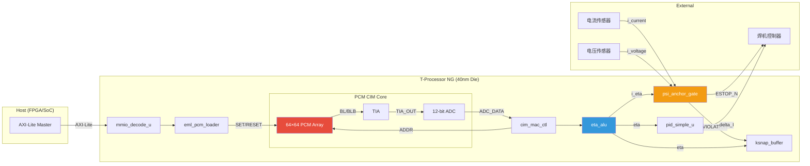

# PCM CIM 引脚标准

> **Phase Change Memory Compute-in-Memory Pin Specification**
>
> 章锋 SLOS 论文 (2026-07-04, 第二版) 第6节
>
> MuJoCo-Bench-IDO v0.4.0 — 2026-07-04

## 1. 概述

本文档定义 PCM (Phase Change Memory) CIM 芯片的完整引脚标准,
基于杨玉超团队可控相变忆阻器工艺, 40nm CMOS 投片规格。

### 电气特性总览

| 参数 | 值 | 说明 |
|------|-----|------|
| VDD_CORE | 0.8V | 核心逻辑电源 |
| VDD_IO | 3.3V | IO接口电源 |
| GND | 0V | 公共地 |
| 工作温度 | -40°C ~ +85°C | 工业级 |
| ESD保护 | HBM 2kV, CDM 500V | 每个Pad |

## 2. 完整引脚表

### 2.1 电源引脚

| 引脚名 | 类型 | 电压 | 说明 |
|--------|------|------|------|
| VDD_CORE | Power | 0.8V | 核心数字逻辑电源 |
| VDD_IO | Power | 3.3V | IO驱动电源 |
| VDD_ANA | Power | 3.3V | 模拟电路电源 (TIA/ADC) |
| GND | Ground | 0V | 数字地 |
| GND_ANA | Ground | 0V | 模拟地 (与GND在封装内短接) |
| VREF | Analog Ref | 0.4V | ADC参考电压 (VDD_CORE/2) |

### 2.2 模拟信号引脚

| 引脚名 | 方向 | 电压范围 | 说明 |
|--------|------|---------|------|
| VREAD_P | In | 0~0.3V | PCM读电压正端 (差分) |
| VREAD_N | In | 0~0.3V | PCM读电压负端 (差分) |
| TIA_OUT | Out | 0~3.3V | 跨阻放大器输出 |
| BL | I/O | 0~0.8V | Bit Line (PCM阵列位线) |
| BLB | I/O | 0~0.8V | Bit Line Bar (差分位线) |
| SL | I/O | 0~3.3V | Source Line (源线) |

### 2.3 数字控制引脚

| 引脚名 | 方向 | 位宽 | 说明 |
|--------|------|------|------|
| CLK | In | 1 | 系统时钟 (50MHz, 3.3V CMOS) |
| RST_N | In | 1 | 异步复位 (低有效) |
| SET_PULSE | Out | 1 | PCM SET 脉冲 (结晶化, 高电导) |
| RESET_PULSE | Out | 1 | PCM RESET 脉冲 (非晶化, 低电导) |
| ADDR_ROW | In/Out | 6 | PCM阵列行地址 [5:0] |
| ADDR_COL | In/Out | 6 | PCM阵列列地址 [5:0] |
| READ_EN | Out | 1 | 读使能 (启动TIA+ADC采样) |
| WRITE_EN | Out | 1 | 写使能 (启动SET/RESET脉冲) |

### 2.4 数字数据引脚

| 引脚名 | 方向 | 位宽 | 说明 |
|--------|------|------|------|
| ADC_DATA | In | 12 | ADC采样数据 [11:0] (读回电导码) |
| DIN | In | 16 | 数据输入 [15:0] (EML权重/指令) |
| DOUT | Out | 16 | 数据输出 [15:0] (MAC结果/状态) |

### 2.5 安全输出引脚

| 引脚名 | 方向 | 位宽 | 说明 |
|--------|------|------|------|
| ESTOP_N | Out | 1 | 急停输出 (低有效, Ψ-Anchor触发) |
| VIOLATION_CODE | Out | 8 | Ψ-Anchor违规码 [7:0] |
| SAFE_STATE | Out | 4 | 安全状态命令 [3:0] |
| WIRE_STICK_ALARM | Out | 1 | 粘丝告警 (专用) |

### 2.6 AXI-Lite 接口引脚

| 引脚名 | 方向 | 位宽 | 说明 |
|--------|------|------|------|
| AXI_ACLK | In | 1 | AXI时钟 (50MHz) |
| AXI_ARESETN | In | 1 | AXI复位 (低有效) |
| AXI_AWADDR | In | 8 | 写地址 [7:0] |
| AXI_AWVALID | In | 1 | 写地址有效 |
| AXI_AWREADY | Out | 1 | 写地址就绪 |
| AXI_WDATA | In | 32 | 写数据 [31:0] |
| AXI_WSTRB | In | 4 | 写选通 [3:0] |
| AXI_WVALID | In | 1 | 写数据有效 |
| AXI_WREADY | Out | 1 | 写数据就绪 |
| AXI_BRESP | Out | 2 | 写响应 [1:0] |
| AXI_BVALID | Out | 1 | 写响应有效 |
| AXI_BREADY | In | 1 | 写响应就绪 |
| AXI_ARADDR | In | 8 | 读地址 [7:0] |
| AXI_ARVALID | In | 1 | 读地址有效 |
| AXI_ARREADY | Out | 1 | 读地址就绪 |
| AXI_RDATA | Out | 32 | 读数据 [31:0] |
| AXI_RRESP | Out | 2 | 读响应 [1:0] |
| AXI_RVALID | Out | 1 | 读数据有效 |
| AXI_RREADY | In | 1 | 读数据就绪 |

### 2.7 JTAG 测试引脚

| 引脚名 | 方向 | 位宽 | 说明 |
|--------|------|------|------|
| TCK | In | 1 | JTAG测试时钟 |
| TMS | In | 1 | JTAG测试模式选择 |
| TDI | In | 1 | JTAG测试数据输入 |
| TDO | Out | 1 | JTAG测试数据输出 |
| TRST_N | In | 1 | JTAG复位 (低有效) |

## 3. 时序参数

### 3.1 PCM SET/RESET 脉冲时序

| 参数 | 最小值 | 典型值 | 最大值 | 单位 | 说明 |
|------|--------|--------|--------|------|------|
| SET 脉冲宽度 | 50 | 100 | 200 | ns | 结晶化脉冲 |
| RESET 脉冲宽度 | 20 | 50 | 100 | ns | 非晶化脉冲 |
| SET 上升时间 | 5 | 10 | 20 | ns | 脉冲边沿 |
| RESET 上升时间 | 2 | 5 | 10 | ns | 快速淬火要求 |
| 脉冲间隔 | 200 | 500 | 1000 | ns | 热恢复间隔 |
| 7脉冲收敛时间 | 1.4 | 3.5 | 7.0 | µs | 总编程时间 |

### 3.2 读操作时序

| 参数 | 值 | 单位 | 说明 |
|------|-----|------|------|
| VREAD 建立时间 | 10 | ns | 读电压稳定 |
| TIA 响应时间 | 50 | ns | 跨阻放大器建立 |
| ADC 转换时间 | 100 | ns | 12位ADC采样 |
| 读总延迟 | 160 | ns | VREAD+TIA+ADC |
| 读吞吐率 | 6.25 | MHz | 连续读频率 |

### 3.3 AXI-Lite 时序

| 参数 | 值 | 单位 | 说明 |
|------|-----|------|------|
| AXI 时钟周期 | 20 | ns | 50MHz |
| 写事务延迟 | 4 | 周期 | AW+W+B |
| 读事务延迟 | 3 | 周期 | AR+R |
| 最大突发 | 1 | — | AXI-Lite单拍 |

### 3.4 Ψ-Anchor 安全门时序

| 参数 | 值 | 单位 | 说明 |
|------|-----|------|------|
| 组合逻辑延迟 | <1.5 | ns | 2级比较+逻辑 |
| 输出缓冲延迟 | <0.5 | ns | Pad驱动 |
| 总响应时间 | <2.0 | ns | << 10ns要求 |
| 建立时间 | 0 | ns | 纯组合, 无建立 |

## 4. 电气特性

### 4.1 PCM 电导参数

| 参数 | 值 | 条件 |
|------|-----|------|
| G_max (SET态) | 100 µS | 完全结晶 |
| G_min (RESET态) | 1 µS | 完全非晶 |
| 电导比 (G_max/G_min) | 100x | ON/OFF比 |
| 电导分辨率 | 16 bit | 0x0000-0xFFFF |
| 电导噪声 (1σ) | <1% | 读回噪声 |
| 保持时间 | >10年 @ 85°C | 数据保持 |
| 写入耐久度 | >10⁹ 次 | SET/RESET循环 |

### 4.2 TIA 参数

| 参数 | 值 | 单位 |
|------|-----|------|
| 跨阻增益 | 1 | MΩ |
| 带宽 | 10 | MHz |
| 输入噪声 | 10 | pA/√Hz |
| 输出摆幅 | 0~3.3 | V |
| 建立时间 | 50 | ns |

### 4.3 ADC 参数

| 参数 | 值 | 单位 |
|------|-----|------|
| 分辨率 | 12 | bit |
| 采样率 | 10 | MSPS |
| INL | <2 | LSB |
| DNL | <1 | LSB |
| 功耗 | 0.5 | mW |
| 转换时间 | 100 | ns |

### 4.4 IO 驱动特性

| 参数 | 值 | 单位 |
|------|-----|------|
| 输出驱动电流 | 4 | mA |
| 上升/下降时间 | 2 | ns |
| 负载电容 | 5 | pF |
| ESD保护 | 2 | kV (HBM) |

## 5. T-Processor NG 接口框图



## 6. 引脚复用策略

部分引脚在工作模式下功能不同:

| 引脚 | 正常模式 | 测试模式 | 复用条件 |
|------|---------|---------|---------|
| DIN[15:0] | EML数据输入 | Scan-in | SCAN_EN=1 |
| DOUT[15:0] | MAC结果输出 | Scan-out | SCAN_EN=1 |
| ADDR_ROW | PCM行地址 | BIST模式选择 | MBIST_EN=1 |
| ADDR_COL | PCM列地址 | BIST参数 | MBIST_EN=1 |
| TDI | JTAG输入 | 模拟测试 | ANA_TEST=1 |
| TDO | JTAG输出 | TIA监视 | ANA_TEST=1 |

## 7. 物理引脚排布 (QFN-32 顶视图)

```
         ┌─────────────────────┐
    TMS ─┤ 1                32 ├─ TRST_N
    TCK ─┤ 2                31 ├─ TDO
    TDI ─┤ 3                30 ├─ VDD_IO
  VDD_IO ─┤ 4                29 ├─ GND
    GND ─┤ 5                28 ├─ DOUT[7]
VDD_CORE ─┤ 6                27 ├─ DOUT[15:8]
    CLK ─┤ 7                26 ├─ DIN[15:0]
  RST_N ─┤ 8                25 ├─ AXI_RDATA
 ESTOP_N ─┤ 9                24 ├─ AXI_ARVALID
 SAFE[3] ─┤10                23 ├─ AXI_WDATA
  VREAD_P ─┤11                22 ├─ ADC_DATA
  VREAD_N ─┤12                21 ├─ ADDR_ROW
  TIA_OUT ─┤13                20 ├─ ADDR_COL
      BL ─┤14                19 ├─ SET_PULSE
     BLB ─┤15                18 ├─ RESET_PULSE
      SL ─┤16                17 ├─ VDD_ANA
         └─────────────────────┘
```

> 多位信号通过时分复用在QFN-32封装上传输。
> 评估板使用QFN-64封装以支持全并行引脚。
