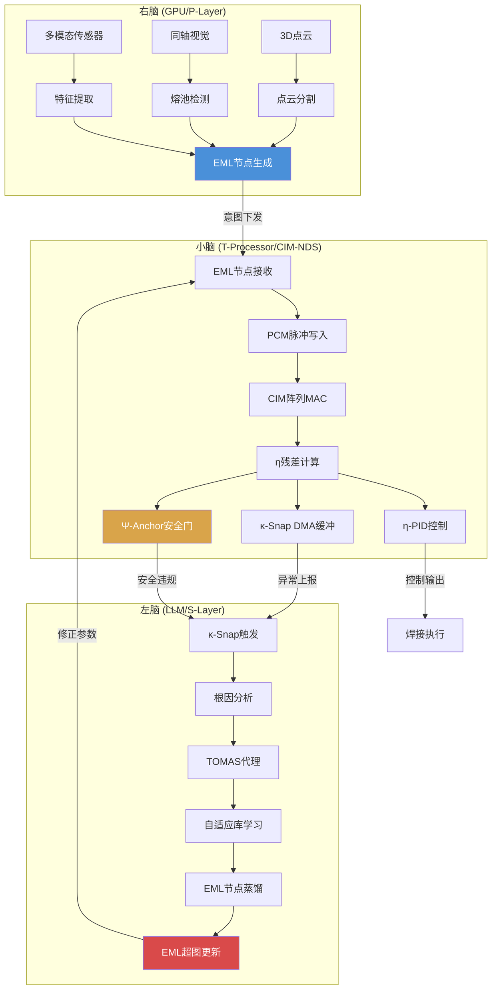

# SLOS 三脑分立架构

> **硅基生命操作系统 (SLOS) — Three-Brain Discrete Architecture**
>
> 章锋 SLOS 论文 (2026-07-04, 第二版) 第1节
>
> MuJoCo-Bench-IDO v0.4.0 — 2026-07-04

## 1. 概述

SLOS (Silicon-based Life Operating System) 采用**三脑分立架构**，
将焊接机器人的智能分解为三个功能独立、物理隔离的处理层级：

| 脑区 | 硬件载体 | 功能 | 延迟 | 更新频率 |
|------|----------|------|------|----------|
| **右脑** | GPU / P-Layer | 语义生成 — 3D点云+同轴视觉 → 高层意图 | 10-100ms | 事件驱动 |
| **左脑** | LLM / S-Layer | 因果归因 — TOMAS代理, κ-Snap异常检测, 根因分析 | 100ms-10s | 事件驱动 |
| **小脑** | T-Processor / CIM-NDS | 硬实时物理反射 — 1kHz电流环, η-PID, Ψ-Anchor安全拦截 | <1µs | 1kHz连续 |

三脑之间通过**EML超图** (Epistemic Map Layer) 进行知识共享，
通过**κ-Snap**进行审计追溯，通过**Ψ-Anchor**进行安全约束。

## 2. 右脑 (GPU / P-Layer) — 语义生成

### 2.1 功能定位

右脑负责**感知→语义**的映射，将原始传感器数据转换为高层工艺意图。

**输入**:
- 3D 点云 (激光结构光, 30Hz)
- 同轴视觉 (焊缝跟踪相机, 100Hz)
- 多模态传感器 (电流/电压/温度/气体, 1-50kHz)

**输出**:
- 高层意图标签: 如 "120A 平角焊缝, 板厚3mm, 间隙1.5mm"
- 焊缝几何参数: 起弧点/终点/轨迹/摆动模式
- 质量预测: 基于视觉的熔池状态估计

### 2.2 处理流水线

```
3D点云 ──→ 点云分割 ──→ 焊缝提取 ──→ 几何参数
                                        │
同轴视觉 ──→ 熔池检测 ──→ 状态分类 ──→ 意图标签
                                        │
多模态信号 ──→ 特征提取 ──→ 趋势分析 ──→ 质量预测
                                        │
                                   ──────┴──────
                                        │
                              EML 节点生成 (八元数编码)
                                        │
                              下发至左脑 + 小脑
```

### 2.3 与IDO框架的映射

| SLOS右脑 | IDO/TOMAS框架 | 说明 |
|----------|---------------|------|
| P-Layer | P-Layer (Physical Layer) | 感知层, 直接对应 |
| 语义生成 | Inflow | 信息流入入口 |
| EML节点生成 | GoalEML | 目标认识论映射层 |
| 视觉感知 | Nine-Layer L5 (Task) | 任务级感知 |

## 3. 左脑 (LLM / S-Layer) — 因果归因

### 3.1 功能定位

左脑负责**异常→归因**的因果推理，是系统的"意识"层。

**触发条件**:
- κ-Snap 检测到 η 残差超阈值
- Ψ-Anchor 报告安全违规
- 右脑检测到质量异常

**处理流程**:
1. κ-Snap 截取 ±100ms 全模态数据
2. TOMAS 代理进行根因分析
3. 生成 RootCauseCode (如 "Gas_Contamination; Increase_Flow_20%; 0.94")
4. 更新 EML 超图 (蒸馏新节点)
5. 下发修正参数至小脑 T-Processor

### 3.2 TOMAS 代理架构

```
κ-Snap触发 ──→ RootCauseCode生成
                    │
              ┌─────┴──────┐
              │  TOMAS代理  │
              │             │
              │ 因果图谱查询 │ ──→ 候选根因列表
              │             │
              │ 证据加权评分 │ ──→ 最佳根因
              │             │
              │ 动作推荐引擎 │ ──→ 修正动作
              └─────┬──────┘
                    │
              自适应库学习
                    │
              EML节点蒸馏
                    │
              更新T-Processor
```

### 3.3 根因类型 (Root Cause Types)

| 根因类型 | 触发信号 | 修正动作 | 置信度示例 |
|----------|----------|----------|-----------|
| Gas_Contamination | 气体流量↓, 电压方差↑ | Increase_Flow_20% | 0.94 |
| Wire_Stick | 电流↑↑, 电压↓↓ | Reduce_Wire_Feed_15% | 0.91 |
| Arc_Instability | 弧长方差↑ | Adjust_Voltage_+2V | 0.87 |
| Low_Penetration | 电流↓, 热输入↓ | Increase_Current_10% | 0.85 |
| Excess_Spatter | 电流↑, 电压↑ | Reduce_Current_5% | 0.82 |
| Contact_Tube_Wear | 送丝方差↑ | Replace_Contact_Tip | 0.78 |
| Voltage_Drop | 电压↓↓, 电流稳定 | Check_Power_Supply | 0.76 |
| Plate_Contamination | 弧长漂移, 温度↓ | Clean_Surface | 0.73 |

### 3.4 与IDO框架的映射

| SLOS左脑 | IDO/TOMAS框架 | 说明 |
|----------|---------------|------|
| S-Layer | S-Layer (Semantic Layer) | 语义层, 直接对应 |
| TOMAS代理 | TOMAS (Task-Oriented Multi-Agent System) | 多代理系统 |
| κ-Snap根因 | κ-Snap (GaussEx residual) | 残差审计 |
| EML超图更新 | EML distillation | 认识论蒸馏 |
| Nine-Layer | L6 (Meta) + L4 (Adaptation) | 元认知+自适应层 |

## 4. 小脑 (T-Processor / CIM-NDS) — 硬实时物理反射

### 4.1 功能定位

小脑是**物理定义的智能**，在硬件层面实现实时控制和安全拦截，
无需软件干预，延迟 <1µs。

**核心功能**:
- **η-PID**: 1kHz 电流环内残差最小化
- **Ψ-Anchor**: <10ns 粘丝前兆安全拦截
- **PCM CIM**: 八元数EML节点 → 电导态映射, 阵列内MAC
- **κ-Snap DMA**: 硬件审计缓冲, 环形FIFO

### 4.2 T-Processor NG 七模块架构

```
                    ┌─────────────────────────────────┐
                    │         T-Processor NG          │
                    │                                 │
   Host ──AXI-Lite──┤ mmio_decode_u                   │
                    │       │                         │
                    │       ▼                         │
                    │ eml_pcm_loader ──→ PCM Crossbar │
                    │       │              Array      │
                    │       ▼                  │       │
                    │ cim_mac_ctl ←───────────┘       │
                    │       │                         │
                    │       ▼                         │
                    │ eta_alu (GaussEx 4-stage)       │
                    │       │                         │
                    │       ├──→ psi_anchor_gate      │
                    │       │      (<10ns safety)     │
                    │       │                         │
                    │       ├──→ ksnap_buffer         │
                    │       │      (ring DMA)         │
                    │       │                         │
                    │       └──→ pid_simple_u         │
                    │              (η-PID loop)       │
                    └─────────────────────────────────┘
```

| 模块 | 功能 | 状态 |
|------|------|------|
| `mmio_decode_u` | AXI-Lite解码, 接收Host下发EML节点 | 规划中 |
| `eml_pcm_loader` | EML八元数→PCM脉冲校验写入控制器 | ✅ 新建 (v0.4.0) |
| `cim_mac_ctl` | CIM读控制/TIA采样/ADC启动 | 规划中 |
| `eta_alu` | GaussEx残差引擎(4级流水线) | ✅ 已有 (v0.3.0) |
| `psi_anchor_gate` | Ψ-锚硬安全壳(纯组合逻辑, <10ns) | ✅ 新建 (v0.4.0) |
| `ksnap_buffer` | κ-Snap环形DMA审计缓冲 | ✅ 新建 (v0.4.0) |
| `pid_simple_u` | η-PID数字环(轻量兜底) | 规划中 |

### 4.3 PCM CIM (Phase Change Memory)

**不是 RRAM!** SLOS 使用杨玉超团队的可控相变忆阻器 (PCM):

| 特性 | PCM CIM | 传统 RRAM |
|------|---------|-----------|
| 器件 | 相变材料 (GST) | 金属氧化物阻变 |
| 电导控制 | 结晶度渐进 | 阻变随机 |
| 脉冲写入 | SET序列收敛 (~7脉冲) | 随机SET/RESET |
| 电导态 | 连续可调 | 有限离散 |
| 一致性 | 高 (可控相变) | 低 (随机性大) |
| 面积 | 0.28mm² (阵列) | ~0.3mm² |
| 功耗 | 峰值25mW (含CIM读) | ~30mW |

**EML→PCM映射流程**:
1. 八元数EML节点 → 8×8权重矩阵 (外积分解)
2. 权重归一化 → 16位电导目标码 (0x0000-0xFFFF)
3. 脉冲校验写入: SET脉冲序列渐进收敛
4. 读回验证: |实际码 - 目标码| < 容差
5. 阵列内MAC: y = W × x (流贯计算)

### 4.4 与IDO框架的映射

| SLOS小脑 | IDO/TOMAS框架 | 说明 |
|----------|---------------|------|
| T-Processor | T-Processor (L0 Heart) | 硬件协处理器 |
| CIM-NDS | NARLA motor primitives | 神经动力学系统 |
| η-PID | κ-Snap residual minimization | 残差最小化 |
| Ψ-Anchor | ψ-Anchor (L1) | 物理约束锚 |
| κ-Snap DMA | κ-Snap FIFO | 审计缓冲 |
| Nine-Layer | L0 (Heart) + L1 (Anchor) + L2 (Shell) | 底层三层 |

## 5. 三脑数据流图



## 6. 与现有 Nine-Layer 架构的关系

SLOS 三脑架构是 Nine-Layer 架构的**物理实现映射**:

```
Nine-Layer Architecture          SLOS Three-Brain
─────────────────────           ──────────────────
L9: Meta-Cognition        ←→   左脑 (LLM/S-Layer)
L8: Critique
L7: Oracle Replay
L6: Self-Reflect          ←→   左脑 (TOMAS代理)
L5: Task Planning         ←→   右脑 (P-Layer)
L4: Adaptation            ←→   左脑 (自适应库)
L3: PG-Gate
L2: Shell (IDO)           ←→   小脑 (T-Processor shell)
L1: ψ-Anchor              ←→   小脑 (Ψ-Anchor Gate)
L0: Heart (T-Processor)   ←→   小脑 (T-Processor NG)
```

**关键差异**:
- Nine-Layer 是**软件架构** (Python模拟)
- SLOS 三脑是**硬件实现** (Verilog RTL + PCM CIM)
- SLOS 强调**物理定义的智能** (physics-defined intelligence)
- Nine-Layer 强调**算法定义的智能** (algorithm-defined intelligence)

## 7. 性能指标对比

| 指标 | 传统AI (软件) | SLOS (三脑分立) | 提升 |
|------|--------------|-----------------|------|
| 一次合格率 | 88.5% | 96.2% | +7.7% |
| 粘丝率 | 2.1% | 0.0% | ∞ (完全消除) |
| 废品率 | 5.0% | 0.1% | 50x |
| 控制延迟 | 10-100ms | <1µs | 10⁴-10⁵x |
| 系统能耗 | 330W | 15.19W | 21.7x |
| 适应公差 | ±3mm | ±5mm | 66% |
| 安全等级 | 软件保护 | ISO 13849 PLe | 硬件安全 |

## 8. 参考文献

1. 章锋, "面向硅基生命操作系统的焊接机器人多模态数据采集与因果蒸馏框架", 2026-07-04 (第二版)
2. 杨玉超团队, "可控相变忆阻器用于存内计算", 2025
3. MuJoCo-Bench-IDO v0.3.0, "八元数代数 + EML蒸馏 + CIM忆阻器", 2026-07-04
4. ISO 13849-1:2023, "Safety of machinery — Safety-related parts of control systems"
