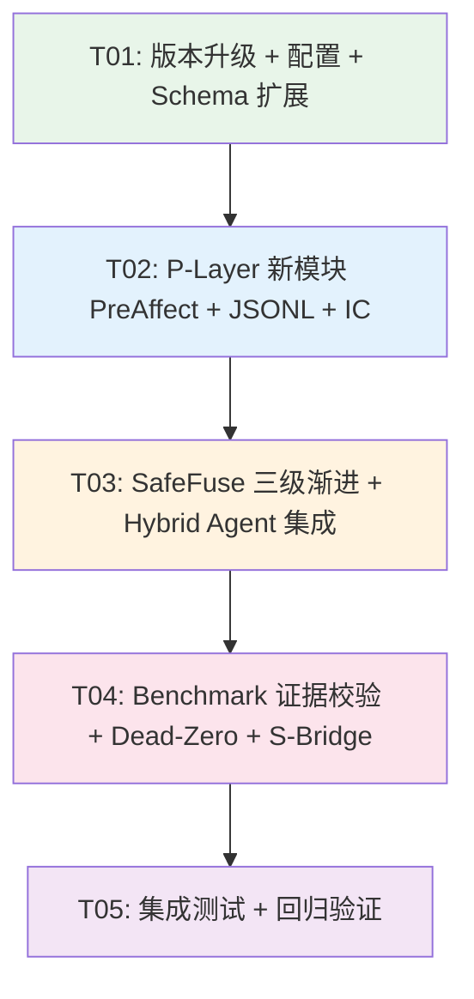

# MuJoCo-Bench-IDO v0.8.0 系统设计

> **架构师**: 高见远 (Gao)  
> **版本**: v0.8.0  
> **日期**: 2026-07-03  
> **基线版本**: v0.7.1 (Hybrid agent physics fix + SafeFuse locomotion bypass)  
> **QA 状态**: 292/292 通过  
> **升级来源**: 4篇复合体理学新文章（章锋 2026-07-03）提取的 6 个升级项

---

## Part A: 系统设计

### 1. 实现方案与框架选型

#### 1.1 核心技术挑战

| 升级项 | 挑战 | 复杂度 |
|--------|------|--------|
| U1 SafeFuse 三级渐进 | 二值→三级决策树重构；locomotion bypass→INFO 级透明路由 | **高** |
| U2 P-Layer 证据自校验 | η 计算结果需外部验证标记；防"主观断言幻觉"需引入 benchmark/pytest 证据链 | **中** |
| U3 κ-Snap 步骤级审计 | MerkleChain append-only→JSONL 文件输出；每步 5 字段记录+Hermes 翻译层 | **中** |
| U4 Pre-Affect 内在信号 | η 停滞/突破→GRRR/PHEW 枚举→Creative-Probe/EXPLOIT 调幅；需 η 窗口检测 | **中** |
| U5 S-Bridge MetaQuery | 4 种自我归因接口；可选插件不侵入主循环；skill 提炼需经验存储 | **中** |
| U6 EML-SemZip Dead-Zero | IC 计算(Shannon 熵)→θ_dead 过滤→高 IC 过采样→毛睿重加权 | **高** |

#### 1.2 框架与库选型

| 用途 | 选型 | 理由 |
|------|------|------|
| 核心 Python 运行时 | Python 3.10+ | 项目已有基线，无升级需求 |
| 科学计算 | NumPy 1.24+ | 已在项目中，IC/Shannon 熵计算依赖 |
| JSON Schema 验证 | jsonschema | 已在 kappa_snap_schema.py 中使用 |
| JSONL 输出 | 内置 json + pathlib | κ-Snap 步骤级审计，无需新框架 |
| 熵计算 (IC) | scipy.stats.entropy + NumPy | Shannon 熵用于 Dead-Zero IC |
| 测试框架 | pytest | 项目已有 292 个测试，沿用 |
| 配置管理 | dataclass | 项目已广泛使用 dataclass |

#### 1.3 架构模式

项目沿用 **分层认知架构** (Cognitive-Motor-Meta 三层):

- **P-Layer (认知层)**: κ-Snap η + Pre-Affect + Evidence Check
- **M-Layer (运动层)**: SB3 base_action + Creative-Probe + SafeFuse
- **S-Layer (元管理层)**: ψ-Anchor + S-Bridge + MerkleChain + CQ

v0.8.0 新增模块分布:

```
core/                    # P-Layer 核心计算模块
  pre_affect.py          # U4: GRRR/PHEW 内在信号
  eml_semzip_ic.py       # U6: IC 计算 + Dead-Zero 过滤 + 毛睿重加权
  kappa_snap_jsonl.py    # U3: JSONL 步骤级审计输出 + Hermes 翻译层

agent/                   # M/S-Layer agent 模块
  safe_fuse.py           # U1: [修改] 三级渐进约束 WARNING→BLOCK→INFO
  hybrid_sb3_ido_agent.py # U1/U2/U4/U5: [修改] 集成新模块
  s_bridge.py            # U5: MetaQuery 自我归因接口（可选插件）

benchmarks/              # Benchmark 验证
  hybrid_benchmark_verify.py # U2/U6: [修改] evidence_verified + IC 过滤
```

---

### 2. 文件列表

#### 2.1 新增文件

| 相对路径 | 升级项 | 说明 |
|----------|--------|------|
| `core/pre_affect.py` | U4 | PreAffect 枚举 (GRRR/PHEW/NEUTRAL) + η 窗口检测 + 调幅因子 |
| `core/eml_semzip_ic.py` | U6 | IC 计算 + Dead-Zero 过滤 + 高 IC 过采样 + 毛睿重加权 |
| `core/kappa_snap_jsonl.py` | U3 | JSONL 步骤级审计文件输出 + Hermes 翻译层 |
| `agent/s_bridge.py` | U5 | S-Bridge MetaQuery 接口 (WHY_THIS_ACTION/AUDIT_SNAP/LEARN_SKILL/JOURNEY_TIMELINE) |
| `tests/test_v080.py` | — | v0.8.0 新功能集成测试 |

#### 2.2 修改文件

| 相对路径 | 升级项 | 修改内容 |
|----------|--------|----------|
| `agent/safe_fuse.py` | U1 | 三级渐进 WARNING→BLOCK→INFO；新增 `check_graded()` 方法；locomotion INFO 级路由 |
| `agent/hybrid_sb3_ido_agent.py` | U1/U2/U4/U5 | 集成 graded SafeFuse、PreAffect、S-Bridge 插件、κ-Snap JSONL |
| `core/kappa_snap_logger.py` | U3 | 新增 JSONL 输出方法 `log_to_jsonl()` |
| `core/kappa_snap_schema.py` | U2/U3 | 新增 `EVIDENCE_CHECK` 事件类型；扩展 schema |
| `core/__init__.py` | — | 导入新模块 (PreAffect, EMLSemZipIC, KappaSnapJSONL) |
| `agent/__init__.py` | — | 导入 S-Bridge |
| `benchmarks/hybrid_benchmark_verify.py` | U2/U6 | evidence_verified flag + IC 过滤 |
| `hybrid_benchmark_verify.py` | U2/U6 | 同上（根级脚本） |

---

### 3. 数据结构与接口

#### 3.1 类图（文字描述）

```
┌─────────────────────────────────────────────────┐
│ PreAffect (core/pre_affect.py)                   │
│─────────────────────────────────────────────────│
│ 枚举: GRRR | PHEW | NEUTRAL                      │
│─────────────────────────────────────────────────│
│ detect(eta_history, window=3) → PreAffect        │
│   GRRR: η 连续3步不降                             │
│   PHEW: η 连续2步降>10%                           │
│ probe_multiplier(affect) → float                 │
│   GRRR: ×1.5 (加强 Creative-Probe)               │
│   PHEW: ×1.5 (延伸 EXPLOIT max_stall)            │
│ stall_extension(affect) → int                    │
│   PHEW: max_stall × 1.5                          │
└─────────────────────────────────────────────────│
         │ 写入 κ-Snap JSONL (pre_affect 字段)
         ↓
┌─────────────────────────────────────────────────┐
│ FuseLevel (agent/safe_fuse.py) — 新增枚举         │
│─────────────────────────────────────────────────│
│ WARNING | BLOCK | INFO | NORMAL                  │
│─────────────────────────────────────────────────│
│ SafeFuse.check_graded(eta, delta_K,              │
│   noether_result, psi_anchor_state,              │
│   torque_ratio) → FuseGradeResult                │
│                                                   │
│ FuseGradeResult:                                  │
│   level: FuseLevel                                │
│   reason: str (触发原因)                           │
│   options: List[FuseOption] (WARNING三选项)        │
│   safe_action: Optional[np.ndarray] (BLOCK替代)   │
│   log_message: str (INFO轻量告知)                  │
│                                                   │
│ FuseOption:                                       │
│   name: str (continue/degrade/abort)              │
│   action_modifier: Callable                       │
│   description: str                                │
└─────────────────────────────────────────────────┘
         │ locomotion → INFO 级（仅记录日志，不修改 action）
         ↓
┌─────────────────────────────────────────────────┐
│ KappaSnapJSONLWriter (core/kappa_snap_jsonl.py)   │
│─────────────────────────────────────────────────│
│ _file_path: pathlib.Path                          │
│ _hermes: HermesTranslator                         │
│─────────────────────────────────────────────────│
│ open(file_path) → None                            │
│ write_step(η, mode, fuse_level,                   │
│   pre_affect, noether_result,                    │
│   evidence_verified) → str (snap_id)             │
│ flush() → None                                    │
│ close() → None                                    │
│ query(snap_id) → Dict (查询)                      │
│─────────────────────────────────────────────────│
│ HermesTranslator:                                 │
│   translate(private_label) → str                  │
│   PRIVATE_MAP: Dict[str, str] 预定义映射          │
│     "L3h" → "ψ-Anchor 触发安全降级"              │
│     "GRRR" → "η停滞焦虑信号"                     │
│     "PHEW" → "η突破释然信号"                      │
│     "EVC" → "证据自校验完成"                       │
└─────────────────────────────────────────────────┘

┌─────────────────────────────────────────────────┐
│ EMLSemZipIC (core/eml_semzip_ic.py)              │
│─────────────────────────────────────────────────│
│ theta_dead: float = 0.45                          │
│ oversample_top_pct: float = 0.05                  │
│ oversample_factor: int = 3                        │
│ mao_rui_power: float = 1.0                        │
│─────────────────────────────────────────────────│
│ compute_ic(trajectory_states) → float             │
│   IC = Shannon熵(Δstate_i) 轨迹状态变化           │
│ is_dead_zero(ic, theta_dead) → bool               │
│ filter_episodes(episodes_data) → filtered         │
│   剔除 IC < θ_dead 的 episode                     │
│ oversample_high_ic(filtered, top_pct, factor)     │
│   Top 5% × 3 过采样                               │
│ reweight_mao_rui(ic_values, power) → weights      │
│   采样概率 ∝ IC^power                              │
│ compute_ic_single(episode_trajectory) → float     │
│─────────────────────────────────────────────────┘

┌─────────────────────────────────────────────────┐
│ SBridge (agent/s_bridge.py) — 可选插件            │
│─────────────────────────────────────────────────│
│ _agent: HybridSB3IDOAgent (引用)                  │
│ _jsonl: KappaSnapJSONLWriter (引用)                │
│ _skill_bank: Dict[str, SkillEntry]                │
│─────────────────────────────────────────────────│
│ why_this_action(state, action, eta) → str         │
│   返回决策理由：mode + fuse_level + pre_affect    │
│ audit_snap(snap_id) → Dict                        │
│   查询 κ-Snap JSONL 日志                          │
│ learn_skill(episodes) → SkillEntry                 │
│   将成功经验提炼为 skill                          │
│ journey_timeline(since_timestamp) → List[Event]   │
│   返回时间线事件列表                              │
│─────────────────────────────────────────────────│
│ SkillEntry:                                       │
│   name: str                                       │
│   task: str                                       │
│   avg_eta: float                                  │
│   avg_cq: float                                   │
│   ic: float                                       │
│   pattern: Dict (提炼的决策模式)                   │
│   created_at: float                               │
└─────────────────────────────────────────────────┘

┌─────────────────────────────────────────────────┐
│ EvidenceVerifiedResult (kappa_snap_schema.py 扩展) │
│─────────────────────────────────────────────────│
│ 新事件类型: EVIDENCE_CHECK                         │
│ required_details: ["benchmark_name",              │
│   "test_result", "evidence_verified"]             │
│ level: L6                                         │
│─────────────────────────────────────────────────┘
```

#### 3.2 关键接口定义

**SafeFuse.check_graded() — 三级渐进约束**

```python
def check_graded(self,
    eta: float,
    delta_K: float,
    noether_result: Dict[str, Any],
    psi_anchor_state: Optional[Any] = None,
    torque_ratio: float = 0.0  # 当前扭矩/最大扭矩
) -> FuseGradeResult:
    """三级渐进约束决策树:
    INFO:     路由变更(locomotion) → 仅记录日志,不修改 action
    WARNING:  接近阈值(torque_ratio ≥ 0.95) → 三选项(继续/降级/中止)
    BLOCK:    严重违反 → 提供替代路径(safe_action)
    NORMAL:   一切正常 → action 不修改
    """
```

**PreAffect.detect() — 内在信号检测**

```python
def detect(self,
    eta_history: List[float],
    window_grrr: int = 3,
    window_phew: int = 2,
    phew_threshold_pct: float = 0.10
) -> PreAffect:
    """η停滞=GRRR: 连续 window_grrr 步 η 不降
    η突破=PHEW: 连续 window_phew 步 η 降 > phew_threshold_pct
    否则=NEUTRAL"""
```

**EMLSemZipIC.compute_ic() — Information Cardinality**

```python
def compute_ic(self,
    trajectory_states: List[np.ndarray]
) -> float:
    """IC = Shannon 熵(Δstate_i)
    Δstate_i = state[t+1] - state[t] (归一化后)
    对 Δstate_i 的分布计算 H = -Σ p_k * log2(p_k)
    高 IC = 轨迹有丰富状态变化(有价值)
    低 IC = 轨迹几乎无变化(噪声/dead-zero)"""
```

**SBridge 接口**

```python
class SBridge:
    """S-Bridge MetaQuery 自我归因接口 — 可选插件"""
    
    def why_this_action(self, state, action, eta) -> str:
        """WHY_THIS_ACTION: 返回决策理由字符串
        格式: "mode={mode}, fuse={fuse_level}, affect={pre_affect}, η={eta:.4f}"
        """
    
    def audit_snap(self, snap_id: str) -> Dict[str, Any]:
        """AUDIT_SNAP: 查询 κ-Snap JSONL 日志"""
    
    def learn_skill(self, episodes: List[Dict]) -> SkillEntry:
        """LEARN_SKILL: 将成功经验提炼为 skill"""
    
    def journey_timeline(self, since: float) -> List[Dict]:
        """JOURNEY_TIMELINE: 返回 since 以来的时间线事件列表"""
```

---

### 4. 程序调用流程

#### 4.1 v0.8.0 选择动作主循环（时序）

```
choose_action(timestep, physics) 主循环 (v0.8.0):

1. 提取 EML 观测 → 计算 η (κ-Snap)
2. 获取 SB3 base_action (运动层)
3. 更新 ψ-Anchor → adjusted δ_K
4. [U4] PreAffect.detect(eta_history) → GRRR/PHEW/NEUTRAL
   └─ GRRR → Creative-Probe perturbation ×1.5
   └─ PHEW → EXPLOIT max_stall ×1.5
   └─ NEUTRAL → 正常
5. η 停滞检测 → 决定 primary_mode
6. Noether 4-gate 检查 → 可能覆盖为 SAFE
7. ψ-Anchor 注入 conservation anchor
8. [U1] SafeFuse.check_graded() → WARNING/BLOCK/INFO/NORMAL
   └─ WARNING → 三选项 (继续/降级/中止)
   └─ BLOCK → 替代路径 (safe_action)
   └─ INFO → 仅记录日志 (locomotion 透明路由)
   └─ NORMAL → 不修改
9. 模式选择 + action 调幅
   └─ PreAffect 调幅因子叠加
10. ψ-Anchor 知性手指限检查
11. PG-Gate 硬锚定夹
12. [U3] κ-Snap JSONL 步骤级记录
    └─ write_step(η, mode, fuse_level, pre_affect, noether_result, evidence_verified)
    └─ Hermes 翻译层处理私有标签
13. CQ 合规记录
14. Creative-Probe 效果评估 (含 PreAffect 调幅)
15. 更新状态变量
```

#### 4.2 P-Layer 证据自校验流程 (U2)

```
hybrid_benchmark_verify.py 主流程:

1. 运行 benchmark episodes → 收集结果
2. [U2] η 完成标记 → 需外部验证才算完成
   └─ benchmark/pytest 结果作为客观证据
   └─ 不是 agent self-report，而是外部验证
3. evidence_verified = True/False 标记
4. κ-Snap 增加 EVIDENCE_CHECK 事件类型
   └─ required_details: benchmark_name, test_result, evidence_verified
5. 若 evidence_verified=False → η 结果标记为"未验证"
```

#### 4.3 EML-SemZip Dead-Zero 过滤流程 (U6)

```
benchmark 结果处理流程:

1. 运行所有 episodes → 收集 trajectory_states
2. [U6] compute_ic(trajectory_states) → IC 值
3. is_dead_zero(ic, θ_dead=0.45) → 判断
   └─ IC < 0.45 → 剔除 (Dead-Zero)
   └─ IC ≥ 0.45 → 保留
4. oversample_high_ic(filtered, top_pct=0.05, factor=3)
   └─ Top 5% IC × 3 过采样
5. reweight_mao_rui(ic_values, power=1.0)
   └─ 采样概率 ∝ IC^power (毛睿度量重加权)
6. 输出过滤后的 benchmark 结果
```

#### 4.4 S-Bridge MetaQuery 调用流程 (U5)

```
SBridge 作为可选插件 (不侵入主循环):

1. HybridSB3IDOAgent.__init__ 增加 s_bridge 参数
   └─ s_bridge: Optional[SBridge] = None
2. 在 choose_action 末尾:
   └─ if self._s_bridge is not None:
       self._s_bridge._record_step(...)
3. 外部调用:
   └─ s_bridge.why_this_action(state, action, eta) → 决策理由
   └─ s_bridge.audit_snap(snap_id) → κ-Snap 日志查询
   └─ s_bridge.learn_skill(episodes) → skill 提炼
   └─ s_bridge.journey_timeline(since) → 时间线
```

---

### 5. 待明确事项 (UNCLEAR)

| # | 事项 | 假设 | 风险 |
|---|------|------|------|
| 1 | WARNING 级三选项如何自动决策？ | 假设由 η 趋势自动选择：η 降→继续，η 平→降级，η 升→中止 | 需确认：是否需要人工介入？ |
| 2 | EVIDENCE_CHECK 的"外部验证"具体指什么？ | 假设指 pytest 测试结果和 benchmark return 均值 | 需确认：是否包括 CQ 报告？ |
| 3 | IC 计算的状态向量来源？ | 假设使用 qpos + qvel 归一化后的差分 | 需确认：是否需要 ee_pos + torso_z？ |
| 4 | S-Bridge learn_skill 的 skill 格式？ | 假设为决策模式 Dict（mode 分布 + fuse 统计 + η 范围） | 需确认：是否需要序列化到文件？ |
| 5 | κ-Snap JSONL 文件路径约定？ | 假设 `logs/kappa_snap_{task}_{timestamp}.jsonl` | 需确认：是否需要统一目录？ |
| 6 | θ_dead=0.45 是否需要按任务类型调整？ | 假设固定值 0.45（来自文12） | locomotion 的 IC 自然更高，可能需要更高的 θ_dead |
| 7 | Hermes 翻译层的映射表是否固定？ | 假设预定义 PRIVATE_MAP，但支持用户扩展 | 需确认：是否需要从配置文件加载？ |
| 8 | v0.7.1 的 locomotion bypass 是否完全替换为 INFO 级？ | 假设是：INFO 级 = 仅记录日志，不修改 action | 需确认：是否保留 bypass 选项？ |

---

## Part B: 任务分解

### 6. 依赖包列表

```
- numpy@^1.24: 科学计算核心 (IC/熵/轨迹处理)
- scipy@^1.10: scipy.stats.entropy (Shannon 熵 IC 计算)
- jsonschema@^4.17: κ-Snap JSON Schema 验证 (已有)
- pytest@^7.4: 测试框架 (已有)
- pathlib: 内置模块 (JSONL 文件路径管理)
- json: 内置模块 (JSONL 行输出)
- hashlib: 内置模块 (MerkleChain hash)
- dataclasses: 内置模块 (配置/数据结构)
```

> **注意**: scipy.stats.entropy 是新增依赖，用于 IC (Information Cardinality) 的 Shannon 熵计算。其余依赖均已在项目中使用。

---

### 7. 任务列表（按依赖顺序）

#### T01: 项目基础设施与版本升级

- **任务名**: 版本号升级 + 配置更新 + JSONL 日志目录创建
- **源文件**: `__init__.py`, `core/__init__.py`, `agent/__init__.py`, `core/kappa_snap_schema.py`, `docs/ROADMAP_v0.8.0.md`
- **依赖**: 无
- **优先级**: P0
- **详细内容**:
  - 全局版本号从 v0.7.1 → v0.8.0
  - core/__init__.py 新增导出: PreAffect, EMLSemZipIC, KappaSnapJSONLWriter
  - agent/__init__.py 新增导出: SBridge
  - kappa_snap_schema.py 新增 EVIDENCE_CHECK 事件类型（L6 级，required_details: benchmark_name, test_result, evidence_verified）
  - 创建 logs/ 目录约定（JSONL 输出目录）
  - 创建 ROADMAP_v0.8.0.md 文档

#### T02: P-Layer 核心计算模块（Pre-Affect + κ-Snap JSONL + EML-SemZip IC）

- **任务名**: P-Layer 新增三个核心计算模块
- **源文件**: `core/pre_affect.py`, `core/kappa_snap_jsonl.py`, `core/eml_semzip_ic.py`, `core/kappa_snap_logger.py`, `tests/test_v080.py`
- **依赖**: T01
- **优先级**: P0
- **详细内容**:
  - **core/pre_affect.py**: PreAffect 枚举(GRRR/PHEW/NEUTRAL) + detect() η窗口检测 + probe_multiplier()/stall_extension() 调幅因子
  - **core/kappa_snap_jsonl.py**: KappaSnapJSONLWriter (open/write_step/flush/close/query) + HermesTranslator (私有标签→人可读映射)
  - **core/eml_semzip_ic.py**: EMLSemZipIC (compute_ic/is_dead_zero/filter_episodes/oversample_high_ic/reweight_mao_rui) + θ_dead=0.45 + 毛睿重加权
  - **core/kappa_snap_logger.py**: 新增 `log_to_jsonl()` 方法，调用 KappaSnapJSONLWriter
  - **tests/test_v080.py**: PreAffect 枚举测试 + IC 计算测试 + JSONL 输出测试 + Dead-Zero 过滤测试

#### T03: SafeFuse 三级渐进 + Hybrid Agent 集成

- **任务名**: SafeFuse 三级渐进约束重构 + HybridSB3IDOAgent 集成所有新模块
- **源文件**: `agent/safe_fuse.py`, `agent/hybrid_sb3_ido_agent.py`, `tests/test_v080.py`
- **依赖**: T02
- **优先级**: P0
- **详细内容**:
  - **agent/safe_fuse.py**: 新增 FuseLevel 枚举(WARNING/BLOCK/INFO/NORMAL) + FuseGradeResult/FuseOption dataclass + check_graded() 方法。保留原 check() 方法向后兼容。locomotion 任务 → INFO 级（仅记录日志，不修改 action）
  - **agent/hybrid_sb3_ido_agent.py**: 
    - 集成 PreAffect: _compute_pre_affect() + Creative-Probe 调幅 ×1.5(GRRR) + EXPLOIT max_stall ×1.5(PHEW)
    - 集成 graded SafeFuse: check_graded() 替换 check() + WARNING 三选项自动决策
    - 集成 κ-Snap JSONL: 每步 write_step()
    - 集成 S-Bridge 插件: __init__ 新增 s_bridge 参数 + choose_action 末尾 _record_step
    - 证据标记: _evidence_verified flag
  - **tests/test_v080.py**: SafeFuse graded 测试 + PreAffect 集成测试 + Hybrid agent v0.8.0 循环测试

#### T04: Benchmark 证据校验 + Dead-Zero 过滤 + S-Bridge

- **任务名**: Benchmark 层 evidence_verified + IC 过滤 + S-Bridge 插件实现
- **源文件**: `benchmarks/hybrid_benchmark_verify.py`, `hybrid_benchmark_verify.py`, `agent/s_bridge.py`, `tests/test_v080.py`
- **依赖**: T03
- **优先级**: P1
- **详细内容**:
  - **benchmarks/hybrid_benchmark_verify.py** + **hybrid_benchmark_verify.py**:
    - 增加 evidence_verified flag (η 完成需外部验证)
    - 增加 IC 计算 + Dead-Zero 过滤 (IC < 0.45 剔除)
    - 增加高 IC 过采样 (Top 5% × 3)
    - 增加毛睿度量重加权 (采样概率 ∝ IC^power)
    - κ-Snap 增加 EVIDENCE_CHECK 事件记录
  - **agent/s_bridge.py**: SBridge 类 + why_this_action/audit_snap/learn_skill/journey_timeline 四接口 + SkillEntry dataclass
  - **tests/test_v080.py**: evidence_verified 测试 + IC 过滤测试 + S-Bridge 四接口测试

#### T05: 集成测试 + 全量回归验证

- **任务名**: v0.8.0 全量集成测试 + 292 测试回归验证
- **源文件**: `tests/test_v080.py`, `tests/test_v060.py`, `tests/test_v060_scenarios.py`, `tests/test_core.py`, `tests/test_agent.py`
- **依赖**: T04
- **优先级**: P1
- **详细内容**:
  - test_v080.py 完整测试覆盖:
    - U1: SafeFuse graded 三级渐进 + locomotion INFO 级
    - U2: evidence_verified 标记
    - U3: κ-Snap JSONL 步骤级输出 + Hermes 翻译
    - U4: PreAffect GRRR/PHEW/NEUTRAL 检测 + 调幅
    - U5: S-Bridge 四接口
    - U6: IC 计算 + Dead-Zero 过滤 + 过采样 + 毛睿重加权
  - 确保原有 292 测试全部通过（回归验证）
  - hybrid_benchmark_verify.py 跑 3 任务 × 3 episodes 验证

---

### 8. 共享知识（跨文件约定）

```
1. 版本号约定
   - 全局版本: IDO_VERSION = "v0.8.0"
   - 各模块内部版本独立（如 pre_affect v0.1.0, s_bridge v0.1.0）
   - 修改已有模块时更新模块内部版本号

2. κ-Snap 事件类型扩展
   - v0.8.0 新增事件类型:
     EVIDENCE_CHECK: L6 级, required_details = ["benchmark_name", "test_result", "evidence_verified"]
     FUSE_WARNING: L4 级, required_details = ["fuse_level", "options", "auto_decision"]
     FUSE_INFO: L4 级, required_details = ["fuse_level", "reason", "locomotion_transparency"]
     PRE_AFFECT_SIGNAL: L4 级, required_details = ["affect_type", "eta_trend", "modifier"]
   - 所有新事件类型必须通过 KappaSnapSchema 验证

3. κ-Snap JSONL 格式约定
   - 每行一个 JSON 对象 (append-only)
   - 必含字段: snap_id, step, η, mode, fuse_level, pre_affect, noether_ok, timestamp
   - 可选字段: evidence_verified, safe_action, probe_type
   - 文件路径: logs/kappa_snap_{task_name}_{episode_id}.jsonl
   - Hermes 翻译: 私有标签 → 人可读字符串映射表

4. SafeFuse 三级渐进约定
   - WARNING: torque_ratio ≥ 0.95 → 三选项自动决策
     η 下降 → "continue", η 平 → "degrade" (×0.8), η 上升 → "abort" (×0.0)
   - BLOCK: 严重违反 → safe_action 替代路径
   - INFO: locomotion 透明路由 → 仅记录日志,不修改 action
   - NORMAL: 一切正常 → action 不修改
   - 每次 fuse 触发必须产生 κ-Snap 审计日志

5. PreAffect 调幅约定
   - GRRR: Creative-Probe perturbation ×1.5 (noise_scale/phase_offset/gain_multiplier)
   - PHEW: EXPLOIT max_stall ×1.5 (延伸稳定区间)
   - NEUTRAL: 无调幅
   - PreAffect 信号写入 κ-Snap JSONL (pre_affect 字段)

6. IC (Information Cardinality) 约定
   - IC = Shannon 熵(Δstate_i 归一化分布)
   - θ_dead = 0.45 (Dead-Zero 过滤阈值)
   - 高 IC 过采样: Top 5% × factor=3
   - 毛睿重加权: 采样概率 ∝ IC^power, power=1.0 默认

7. P-Layer 证据校验约定
   - η 完成标记 → 需外部验证才算完成
   - 外部验证 = benchmark/pytest 结果,不是 agent self-report
   - evidence_verified flag: True/False
   - 若 False → η 结果标记为"未验证",不作为决策依据

8. S-Bridge 插件约定
   - 可选插件,不强制启用 (s_bridge=None → 不启用)
   - 不侵入 choose_action 主循环 (仅在末尾 _record_step)
   - 四接口: WHY_THIS_ACTION, AUDIT_SNAP, LEARN_SKILL, JOURNEY_TIMELINE
   - SkillEntry 存储: agent 内部 Dict,不依赖外部数据库

9. 代码注释约定
   - 所有代码使用中文注释
   - 模块级注释标注版本号和升级来源 (如 "v0.8.0 升级项 U4")
   - 新增方法标注对应的升级项编号

10. 向后兼容约定
    - SafeFuse.check() 保留 (向后兼容 v0.7.x)
    - SafeFuse.check_graded() 为新增方法
    - HybridSB3IDOAgent 默认 s_bridge=None (不启用 → 无影响)
    - κ-Snap JSONL 默认不输出 (需显式启用)
```

---

### 9. 任务依赖图



---

## 附录: 升级项对照表

| 升级项 | 来源文章 | 新增/修改模块 | 核心类/方法 |
|--------|----------|---------------|-------------|
| U1 SafeFuse 三级渐进 | 文13 ψ-Anchor Transparency Protocol | safe_fuse.py [修改] | FuseLevel, check_graded() |
| U2 P-Layer 证据自校验 | 文15 "Subjective Assertion Hallucination" | kappa_snap_schema.py [修改], hybrid_benchmark_verify.py [修改] | EVIDENCE_CHECK, evidence_verified |
| U3 κ-Snap 步骤级审计 | 文12 κ-Snap specification + 文15 "缺细粒度因果链" | kappa_snap_jsonl.py [新增], kappa_snap_logger.py [修改] | KappaSnapJSONLWriter, HermesTranslator |
| U4 Pre-Affect 内在信号 | 文13 Pre-Affect as intrinsic reward signal | pre_affect.py [新增] | PreAffect, detect() |
| U5 S-Bridge MetaQuery | 文12 S-Layer interface specification | s_bridge.py [新增] | SBridge, why_this_action() |
| U6 EML-SemZip Dead-Zero | 文12 EML-SemZip data governance + Dead-Zero pruning | eml_semzip_ic.py [新增], hybrid_benchmark_verify.py [修改] | EMLSemZipIC, compute_ic() |
