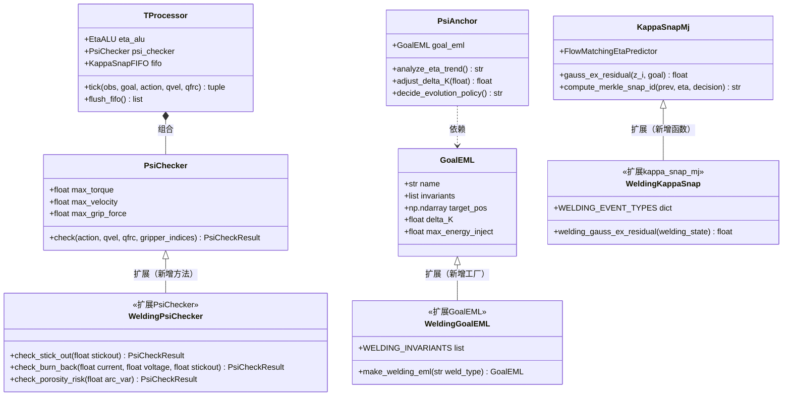
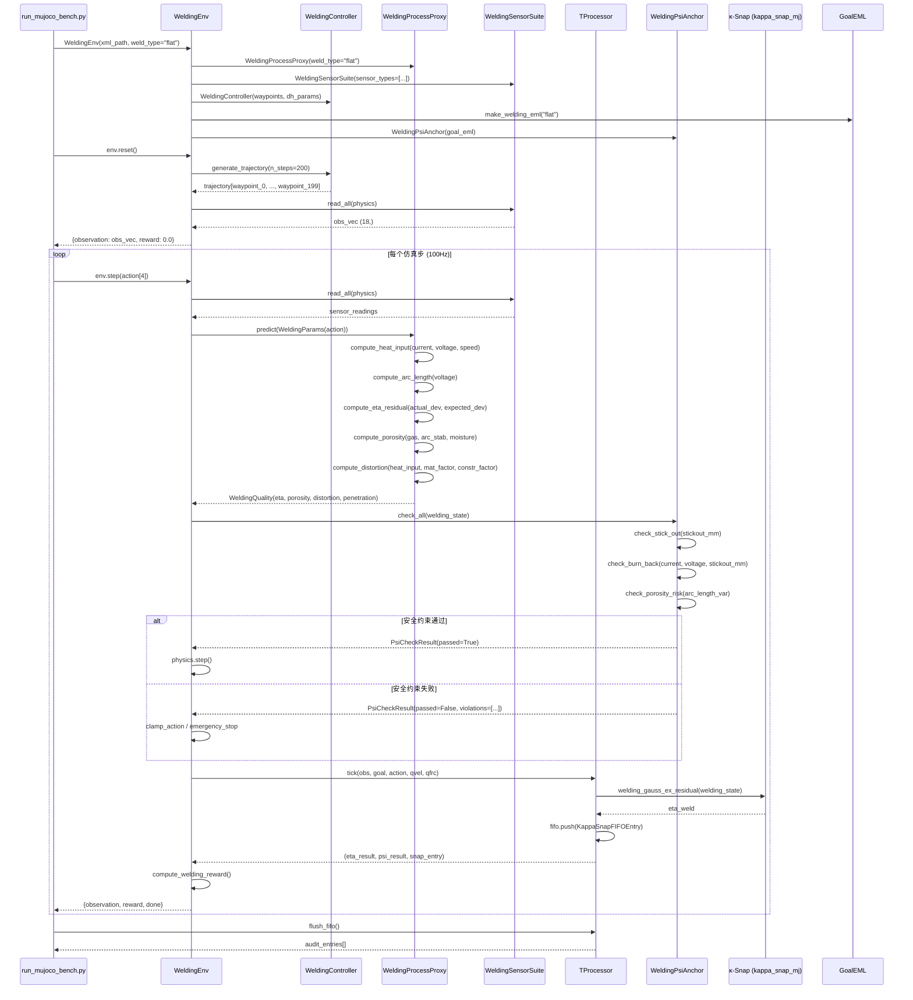
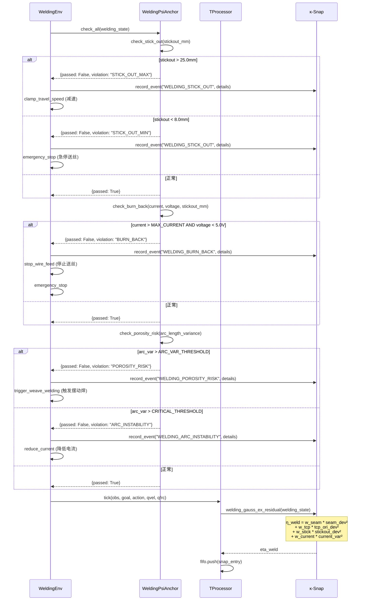
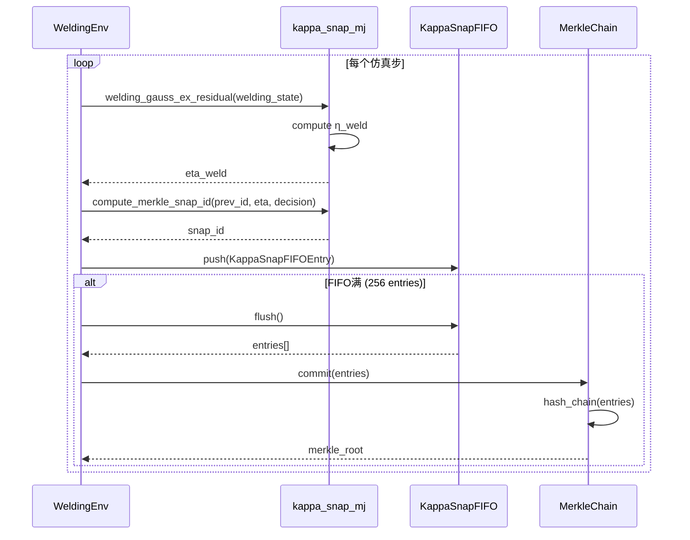

# 焊接机器人仿真系统架构设计

> **项目**: MuJoCo-Bench-IDO 焊接域扩展  
> **架构师**: 高见远 (Gao)  
> **版本**: v1.0.0  
> **日期**: 2026-07-01  
> **基于**: 产品经理许清楚的焊接机器人PRD + 论文附录Q/R技术细节

---

## 目录

- [Part A: 系统设计](#part-a-系统设计)
  - [1. 实现方案与框架选型](#1-实现方案与框架选型)
  - [2. 文件列表及相对路径](#2-文件列表及相对路径)
  - [3. 数据结构和接口（类图）](#3-数据结构和接口类图)
  - [4. 程序调用流程（时序图）](#4-程序调用流程时序图)
  - [5. 待明确事项](#5-待明确事项)
- [Part B: 任务分解](#part-b-任务分解)
  - [6. 依赖包列表](#6-依赖包列表)
  - [7. 任务列表](#7-任务列表)
  - [8. 共享知识（跨文件约定）](#8-共享知识跨文件约定)
  - [9. 任务依赖图](#9-任务依赖图)

---

# Part A: 系统设计

## 1. 实现方案与框架选型

### 1.1 核心技术挑战

| 挑战 | 描述 | 解决方案 |
|------|------|----------|
| **六轴机器人运动学** | 需要精确的六轴机器人正/逆运动学，支撑焊缝跟踪轨迹规划 | 使用MuJoCo内置运动学求解器 + 自研IK求解器（基于阻尼最小二乘法/Levenberg-Marquardt），避免引入ROS/MoveIt等重型依赖 |
| **焊接物理代理模型** | 真实焊接涉及流体力学/MHD，计算成本极高 | 采用论文附录R的WeldingProcessProxy代理模型，用经验公式+多项式回归近似焊接质量映射，不模拟流体力学 |
| **DreamerV3世界模型集成** | 现有dreamer_adapter适配dm_control标准任务，焊接环境需自定义obs/action空间 | 扩展DreamerAdapter，新增WeldingDreamerAdapter子类，重写obs编码器（18维向量）和action解码器（4维连续） |
| **Ψ-Anchor焊接安全约束** | 需要将IDO的Ψ-Anchor体系扩展到焊接域，增加STICK_OUT/BURN_BACK/POROSITY_RISK三类门控 | 在现有PsiChecker基础上扩展WeldingPsiChecker子类，新增焊接约束检查方法，保持与现有MAX_TORQUE/MAX_VELOCITY约束并行 |
| **κ-Snap焊接事件扩展** | 现有κ-Snap仅支持通用事件类型，需新增6种焊接专属事件 | 在kappa_snap_mj.py中扩展事件类型枚举 + 新增welding专用η计算函数 |
| **EML蒸馏到焊接域** | 现有GoalEML面向dm_control标准任务，需扩展焊接域超图节点 | 新增welding_eml_distill.py，定义焊接域EML节点和蒸馏接口 |

### 1.2 技术栈选择

| 组件 | 选择 | 版本 | 理由 |
|------|------|------|------|
| **物理引擎** | MuJoCo | ≥3.1.0 | 项目已使用，支持六轴机器人+变位机+传感器的复杂场景定义 |
| **Python** | CPython | 3.11 | 项目.venvs/r2dreamer/已配置3.11环境 |
| **PyTorch** | torch | ≥2.1.0 | DreamerV3依赖，.venvs/r2dreamer/已安装 |
| **dm_control** | dm_control | ≥1.0.0 | 项目现有PinchLeafEnv的基础依赖 |
| **NumPy** | numpy | ≥1.24.0 | 数值计算核心 |
| **SciPy** | scipy | ≥1.11.0 | IK求解器中的优化算法（L-BFGS-B/Levenberg-Marquardt） |
| **Matplotlib** | matplotlib | ≥3.7.0 | 焊接轨迹可视化、对比评估图表 |
| **Jinja2** | jinja2 | ≥3.1.0 | WPS/PQR文档生成模板引擎 |

### 1.3 与现有系统的集成方式

```
┌─────────────────────────────────────────────────────────────┐
│                    MuJoCo-Bench-IDO 现有架构                  │
│                                                              │
│  ┌──────────┐  ┌──────────┐  ┌──────────┐  ┌──────────┐   │
│  │  webviz/  │  │  envs/   │  │  agent/  │  │  core/   │   │
│  │ server.py │  │ pinch_   │  │ hybrid_  │  │ t_proc   │   │
│  │ tomas_    │  │ leaf_env │  │ dreamer  │  │ kappa_   │   │
│  │ wrapper   │  │ dmctrl_  │  │ psi_     │  │ snap     │   │
│  │           │  │ wrapper  │  │ anchor   │  │ goal_eml │   │
│  └─────┬─────┘  └────┬─────┘  └────┬─────┘  └────┬─────┘   │
│        │             │             │             │          │
│        └─────────────┴─────────────┴─────────────┘          │
│                           │                                  │
│  ═════════════════════════╪══════════════════════════════    │
│                     焊接域扩展层                               │
│  ═════════════════════════╪══════════════════════════════    │
│                           │                                  │
│  ┌─────────────┐  ┌───────┴──────┐  ┌────────┴────────┐     │
│  │ envs/assets/ │  │ envs/        │  │ agent/          │     │
│  │ mujoco_weld  │  │ welding_env  │  │ welding_        │     │
│  │ _robot.xml   │  │ .py          │  │ controller.py   │     │
│  │              │  │              │  │ welding_psi_    │     │
│  │              │  │              │  │ anchor.py       │     │
│  └──────────────┘  └──────────────┘  └─────────────────┘     │
│                                                           │
│  ┌──────────────┐  ┌──────────────┐  ┌──────────────┐      │
│  │ core/        │  │ baselines/   │  │ benchmarks/  │      │
│  │ welding_     │  │ dreamer_     │  │ welding_     │      │
│  │ process_     │  │ weld_train   │  │ compare.py   │      │
│  │ proxy.py     │  │ .py          │  │              │      │
│  │ welding_     │  │              │  │              │      │
│  │ eml_distill  │  │              │  │              │      │
│  │ .py          │  │              │  │              │      │
│  └──────────────┘  └──────────────┘  └──────────────┘      │
│                                                           │
│  ┌──────────────┐  ┌──────────────┐                       │
│  │ core/        │  │ tools/       │                       │
│  │ welding_     │  │ wps_pqr_     │                       │
│  │ sensors.py   │  │ generator    │                       │
│  │ tomas_       │  │ .py          │                       │
│  │ welding_     │  │              │                       │
│  │ axioms.py    │  │              │                       │
│  └──────────────┘  └──────────────┘                       │
└─────────────────────────────────────────────────────────────┘
```

**集成策略**:
1. **envs/assets/** 新建目录存放焊接XML，与现有pinch_leaf.xml并列
2. **WeldingEnv** 继承PinchLeafEnv的dm_control模式，复用`_make_timestep`、`physics`属性等模式
3. **T-Processor升级** 通过在PsiChecker中新增焊接约束方法实现扩展，不破坏现有MAX_TORQUE等逻辑
4. **κ-Snap升级** 在kappa_snap_mj.py中新增welding专用函数和事件类型，保持gauss_ex_residual向后兼容
5. **GoalEML升级** 在goal_eml_mj.py中新增make_welding_eml工厂函数
6. **DreamerV3适配** 新增dreamer_weld_train.py，复用third_party/r2dreamer/的RSSM/Actor/Critic

### 1.4 焊接场景与SO-ARM100场景的关系

**决策：独立共存**

| 方面 | SO-ARM100场景 | 焊接场景 |
|------|--------------|---------|
| XML文件 | webviz/scenes/so_arm100_scene.xml | envs/assets/mujoco_weld_robot.xml |
| 环境 | PinchLeafEnv / dmctrl_wrapper | WeldingEnv (新) |
| 机器人 | SO-ARM100 (夹爪) | 六轴焊接机器人 + 双轴变位机 |
| 任务 | 捏飘叶/抓取 | 焊缝跟踪+工艺参数优化 |
| 传感器 | 关节力矩/接触力 | TCP位姿/干伸长/电弧/温度 |
| 安全约束 | MAX_TORQUE/MAX_GRIP_FORCE | STICK_OUT/BURN_BACK/POROSITY_RISK |

两套场景**完全独立**，通过统一的T-Processor/κ-Snap/EML接口共享IDO认知层架构。webviz/server.py的FastAPI dashboard可同时展示两种场景的仿真状态。

---

## 2. 文件列表及相对路径

### 2.1 新建文件

| # | 文件路径 | 所属模块 | 对应需求 | 说明 |
|---|---------|---------|---------|------|
| 1 | `envs/assets/mujoco_weld_robot.xml` | envs | W01 | MuJoCo焊接场景XML（六轴机器人+双轴变位机+焊枪+传感器） |
| 2 | `envs/welding_env.py` | envs | W02 | WeldingEnv类，action_dim=4, obs_dim=18 |
| 3 | `agent/welding_controller.py` | agent | W03 | 6-DOF焊缝跟踪控制器，IK求解+轨迹生成 |
| 4 | `agent/welding_psi_anchor.py` | agent | W04 | 焊接Ψ-Anchor安全门控（STICK_OUT/BURN_BACK/POROSITY_RISK） |
| 5 | `core/welding_process_proxy.py` | core | W07 | 焊接工艺代理模型（经验公式+多项式回归） |
| 6 | `core/welding_sensors.py` | core | W11 | 多模态焊接传感器仿真（7类） |
| 7 | `core/welding_eml_distill.py` | core | W09 | EML焊接域蒸馏（Pareto最优搜索+蒸馏接口） |
| 8 | `core/tomas_welding_axioms.py` | core | W14 | TOMAS焊接工艺公理库 |
| 9 | `baselines/dreamer_weld_train.py` | baselines | W08 | DreamerV3焊接训练脚本（RSSM+Actor+Critic） |
| 10 | `benchmarks/welding_compare.py` | benchmarks | W10 | 焊接对比评估（IDO/DreamerV3 vs PID vs VLA） |
| 11 | `tools/wps_pqr_generator.py` | tools | W13 | WPS/PQR焊接工艺文档生成 |
| 12 | `tests/test_welding_env.py` | tests | — | WeldingEnv单元测试 |
| 13 | `tests/test_welding_safety.py` | tests | — | 焊接安全约束测试 |
| 14 | `tests/test_welding_controller.py` | tests | — | 焊缝跟踪控制器测试 |

### 2.2 修改文件

| # | 文件路径 | 修改内容 | 对应需求 |
|---|---------|---------|---------|
| 1 | `core/t_processor.py` | PsiChecker新增焊接约束检查方法（STICK_OUT/BURN_BACK/POROSITY_RISK）；TProcessor.tick()新增焊接参数传入 | W04 |
| 2 | `core/kappa_snap_mj.py` | 新增焊接η计算函数`welding_gauss_ex_residual()`；新增6种焊接κ-Snap事件类型枚举 | W05, W06 |
| 3 | `core/goal_eml_mj.py` | 新增`make_welding_eml()`工厂函数 + 焊接域EML节点定义 | W09 |
| 4 | `webviz/server.py` | 新增焊接场景API端点 + 焊接dashboard数据推送 | 可视化 |
| 5 | `run_mujoco_bench.py` | 新增焊接benchmark入口 | 集成 |

### 2.3 文件分组总览

```
mujoco-bench-ido/
├── envs/
│   ├── assets/
│   │   └── mujoco_weld_robot.xml      [新建] W01
│   ├── welding_env.py                 [新建] W02
│   ├── pinch_leaf_env.py              [现有]
│   ├── pinch_leaf.xml                 [现有]
│   └── dmctrl_wrapper.py             [现有]
├── agent/
│   ├── welding_controller.py          [新建] W03
│   ├── welding_psi_anchor.py          [新建] W04
│   ├── psi_anchor.py                  [现有]
│   └── hybrid_dreamer_ido_agent.py    [现有]
├── core/
│   ├── t_processor.py                 [修改] W04
│   ├── kappa_snap_mj.py               [修改] W05, W06
│   ├── goal_eml_mj.py                 [修改] W09
│   ├── welding_process_proxy.py       [新建] W07
│   ├── welding_sensors.py             [新建] W11
│   ├── welding_eml_distill.py         [新建] W09
│   └── tomas_welding_axioms.py        [新建] W14
├── baselines/
│   ├── dreamer_weld_train.py          [新建] W08
│   └── dreamer_adapter.py             [现有]
├── benchmarks/
│   └── welding_compare.py             [新建] W10
├── tools/
│   └── wps_pqr_generator.py           [新建] W13
├── tests/
│   ├── test_welding_env.py            [新建]
│   ├── test_welding_safety.py         [新建]
│   └── test_welding_controller.py     [新建]
├── webviz/
│   └── server.py                      [修改]
└── run_mujoco_bench.py                [修改]
```

---

## 3. 数据结构和接口（类图）

### 3.1 核心类关系图

```mermaid
classDiagram
    class WeldingEnv {
        +int ACTION_DIM = 4
        +int OBS_DIM = 18
        +str VERSION
        +float WELD_TIMESTEP
        -np.ndarray _weld_waypoints
        -int _current_waypoint_idx
        -WeldingProcessProxy _process_proxy
        -WeldingSensorSuite _sensors
        -np.ndarray _action_low
        -np.ndarray _action_high
        +__init__(xml_path, weld_type, random_seed)
        +reset() dict
        +step(np.ndarray action) dict
        +get_observation() np.ndarray
        +compute_welding_reward() float
        -_compute_stickout() float
        -_compute_seam_deviation() float
        -_check_safety() bool
    }

    class WeldingController {
        +float TRACKING_TOLERANCE
        -np.ndarray _waypoints
        -np.ndarray _joint_limits_low
        -np.ndarray _joint_limits_high
        -float _damping_coeff
        +__init__(waypoints, robot_dh_params)
        +solve_ik(np.ndarray tcp_target) np.ndarray
        +generate_trajectory(int n_steps) list~np.ndarray~
        +compute_tracking_error(np.ndarray tcp_actual, np.ndarray tcp_target) float
        -_forward_kinematics(np.ndarray joint_angles) np.ndarray
        -_jacobian(np.ndarray joint_angles) np.ndarray
        -_damped_least_squares(np.ndarray J, np.ndarray error) np.ndarray
    }

    class WeldingPsiAnchor {
        +float STICK_OUT_MIN = 8.0
        +float STICK_OUT_MAX = 25.0
        +float MAX_CURRENT = 350.0
        +float MIN_VOLTAGE = 5.0
        +float ARC_LENGTH_VAR_THRESH
        -WeldingPsiChecker _welding_checker
        +__init__(GoalEML goal_eml)
        +check_stick_out(float stickout_mm) PsiCheckResult
        +check_burn_back(float current, float voltage, float stickout_mm) PsiCheckResult
        +check_porosity_risk(float arc_length_variance) PsiCheckResult
        +check_all(WeldingState state) PsiCheckResult
    }

    class WeldingProcessProxy {
        +dict EMPIRICAL_COEFFS
        -dict _weld_type_params
        +__init__(str weld_type)
        +predict(WeldingParams params) WeldingQuality
        +compute_heat_input(float current, float voltage, float speed) float
        +compute_arc_length(float voltage) float
        +compute_eta_residual(float actual_dev, float expected_dev) float
        +compute_porosity(float gas_coverage, float arc_stab, float moisture) float
        +compute_distortion(float heat_input, float material_factor, float constraint_factor) float
        +compute_penetration(float current, float voltage, float speed) float
    }

    class WeldingParams {
        +float current
        +float voltage
        +float travel_speed
        +float wire_feed
        +float stickout
        +float weave_amplitude
        +str weld_type
    }

    class WeldingQuality {
        +float eta_residual
        +float porosity_risk
        +float angular_distortion
        +float penetration_depth
        +float arc_length
        +float heat_input
    }

    class WeldingSensorSuite {
        -dict _sensor_configs
        -np.ndarray _sensor_readings
        +__init__(list sensor_types)
        +read_all(physics) dict
        +read_tcp_pose(physics) np.ndarray
        +read_stickout(physics) float
        +read_contact_force(physics) np.ndarray
        +read_temperature(physics) float
        +read_arc_current(physics) float
        +read_seam_deviation(physics) float
        +read_joint_torques(physics) np.ndarray
    }

    class WeldingDreamerTrainer {
        +int NUM_EPISODES = 1000
        +int BATCH_SIZE = 50
        +int SEQUENCE_LEN = 50
        +int HORIZON = 15
        -WeldingEnv _env
        -RSSM _world_model
        -Actor _actor
        -Critic _critic
        -ReplayBuffer _buffer
        +__init__(WeldingEnv env, dict config)
        +train() dict
        +collect_episode() dict
        +imagine_trajectory(np.ndarray latent) list
        +compute_welding_reward(np.ndarray latent) float
        -_update_world_model(dict batch) dict
        -_update_actor_critic(dict batch) dict
        +save_checkpoint(str path)
        +load_checkpoint(str path)
    }

    class WeldingEMLDistiller {
        -GoalEML _welding_eml
        -WeldingProcessProxy _proxy
        -list _pareto_front
        +__init__(GoalEML eml, WeldingProcessProxy proxy)
        +search_pareto_optimal(int n_trials) list
        +distill_to_eml(WeldingParams optimal) GoalEML
        +compute_pareto_front(WeldingParams params) list
        -_evaluate_params(WeldingParams params) WeldingQuality
    }

    class WeldingCompare {
        +dict BENCHMARK_METHODS
        -WeldingEnv _env
        +__init__(WeldingEnv env)
        +run_all(int n_episodes) dict
        +run_ido(int n_episodes) dict
        +run_dreamer(int n_episodes) dict
        +run_pid(int n_episodes) dict
        +run_vla(int n_episodes) dict
        +generate_latex_table(dict results) str
        -_compute_metrics(dict episode_data) dict
    }

    class WpsPqrGenerator {
        +dict WPS_TEMPLATE
        +dict PQR_TEMPLATE
        -Jinja2Environment _jinja_env
        +__init__()
        +generate_wps(WeldingParams params, WeldingQuality quality) str
        +generate_pqr(WeldingParams params, WeldingQuality quality) str
        +generate_both(WeldingParams params, WeldingQuality quality) dict
        -_validate_params(WeldingParams params) bool
    }

    class TomasWeldingAxioms {
        +list AXIOMS
        +dict AXIOM_PARAMS
        +__init__()
        +get_axiom(str name) dict
        +check_axiom(str name, WeldingState state) bool
        +get_all_axioms() list
        -_check_heat_input_axiom(WeldingState state) bool
        -_check_stickout_axiom(WeldingState state) bool
        -_check_porosity_axiom(WeldingState state) bool
    }

    %% 继承关系
    WeldingEnv --> PinchLeafEnv : 继承模式（不直接继承，复用dm_control模式）
    WeldingPsiAnchor --> PsiAnchor : 扩展

    %% 组合关系
    WeldingEnv *-- WeldingProcessProxy : 包含
    WeldingEnv *-- WeldingSensorSuite : 包含
    WeldingDreamerTrainer *-- WeldingEnv : 包含
    WeldingEMLDistiller *-- WeldingProcessProxy : 包含
    WeldingCompare *-- WeldingEnv : 包含

    %% 依赖关系
    WeldingEnv ..> WeldingController : 使用（轨迹规划）
    WeldingEnv ..> WeldingPsiAnchor : 使用（安全门控）
    WeldingPsiAnchor ..> WeldingParams : 使用
    WeldingProcessProxy ..> WeldingParams : 输入
    WeldingProcessProxy ..> WeldingQuality : 输出
    WpsPqrGenerator ..> WeldingParams : 输入
    WpsPqrGenerator ..> WeldingQuality : 输入
    TomasWeldingAxioms ..> WeldingQuality : 检查
```



### 3.2 与现有core模块的接口关系



### 3.3 关键数据结构定义

```python
# ── 焊接参数（action空间） ──
@dataclass
class WeldingParams:
    current: float          # 焊接电流 (A), 范围 [50, 350]
    voltage: float          # 焊接电压 (V), 范围 [14, 32]
    weave_amplitude: float  # 摆动幅度 (mm), 范围 [0, 5]
    travel_speed: float     # 焊接速度 (mm/s), 范围 [2, 15]

# ── 焊接质量输出 ──
@dataclass
class WeldingQuality:
    eta_residual: float         # η残差 (焊缝偏差综合)
    porosity_risk: float        # 气孔率风险 [0, 1]
    angular_distortion: float   # 角变形 (度)
    penetration_depth: float    # 熔深 (mm)
    arc_length: float           # 电弧长度 (mm)
    heat_input: float           # 热输入 (kJ/mm)

# ── 焊接观测向量 (obs_dim=18) ──
# [0:6]   TCP位姿 (x, y, z, rx, ry, rz)
# [6:12]  关节角度 (joint1-6)
# [12]    干伸长 (mm)
# [13:16] 接触力 (fx, fy, fz)
# [16]    温度 (°C)
# [17]    焊缝偏差 (mm)

# ── 焊接κ-Snap事件类型 ──
WELDING_EVENT_TYPES = {
    "WELDING_STICK_OUT":      "干伸长超限 (stickout > 25mm or < 8mm)",
    "WELDING_BURN_BACK":      "回烧 (current > MAX and voltage < 5V)",
    "WELDING_POROSITY_RISK":  "气孔风险 (arc_length_variance > threshold)",
    "WELDING_SEAM_DEVIATION": "焊缝偏差超限 (deviation > 0.5mm)",
    "WELDING_THERMAL_LIMIT":  "热输入超限 (heat_input > max_kJ/mm)",
    "WELDING_ARC_INSTABILITY":"电弧不稳定 (arc_length_variance > critical)",
}

# ── 焊接安全约束阈值 ──
WELDING_SAFETY_THRESHOLDS = {
    "STICK_OUT_MIN":      8.0,    # mm
    "STICK_OUT_MAX":      25.0,   # mm
    "MAX_CURRENT":        350.0,  # A
    "MIN_VOLTAGE":        5.0,    # V (below this → burn_back)
    "ARC_VAR_THRESHOLD":  0.5,    # 电弧长度方差阈值
    "MAX_HEAT_INPUT":     2.5,    # kJ/mm
    "SEAM_DEV_MAX":       0.5,    # mm
}
```

---

## 4. 程序调用流程（时序图）

### 4.1 焊接仿真主循环



### 4.2 DreamerV3训练流程

```mermaid
sequenceDiagram
    participant Train as dreamer_weld_train.py
    participant Env as WeldingEnv
    participant Buffer as ReplayBuffer
    participant RSSM as RSSM WorldModel
    participant Actor as Actor Network
    participant Critic as Critic Network
    participant EML as WeldingEMLDistiller

    Train->>Env: WeldingEnv(weld_type="flat")
    Train->>Buffer: ReplayBuffer(capacity=1e6)
    Train->>RSSM: RSSM(obs_dim=18, action_dim=4, hidden=512)
    Train->>Actor: Actor(latent_dim, action_dim=4)
    Train->>Critic: Critic(latent_dim)

    loop Episode 1..1000
        Train->>Env: env.reset()
        Env-->>Train: obs (18,)

        loop Steps (episode内)
            Train->>Actor: policy(obs)
            Actor-->>Train: action (4,)
            Train->>Env: env.step(action)
            Env-->>Train: {obs, reward, done}
            Train->>Buffer: add(obs, action, reward, done)
        end

        Train->>Buffer: sample(batch=50, seq_len=50)
        Buffer-->>Train: batch

        loop 训练迭代
            Train->>RSSM: encode(batch.observations)
            RSSM-->>Train: latent_states

            Train->>RSSM: rollout(latent, batch.actions, horizon=15)
            RSSM-->>Train: imagined_trajectories

            Train->>RSSM: compute_loss(batch, latent)
            RSSM-->>Train: world_model_loss
            Train->>RSSM: backward(world_model_loss)

            Train->>Actor: compute_policy_loss(imagined_traj)
            Note over Actor: reward = -eta*10 - porosity*20<br/>- distortion*50 - stickout_penalty
            Actor-->>Train: actor_loss
            Train->>Actor: backward(actor_loss)

            Train->>Critic: compute_value_loss(imagined_traj)
            Critic-->>Train: critic_loss
            Train->>Critic: backward(critic_loss)
        end
    end

    Train->>EML: WeldingEMLDistiller(eml, proxy)
    Train->>EML: search_pareto_optimal(n_trials=1000)
    EML->>Env: evaluate_params(WeldingParams)
    Env->>Env: run_episode(params)
    Env-->>EML: WeldingQuality
    EML-->>Train: pareto_front[]
    Train->>EML: distill_to_eml(optimal_params)
    EML-->>Train: GoalEML(welding_nodes)
    Train->>Train: save_checkpoint("welding_dreamer_v1.pt")
```

### 4.3 Ψ-Anchor安全门控触发流程



### 4.4 κ-Snap焊接事件记录与Merkle链



---

## 5. 待明确事项

### 5.1 PRD待确认问题的技术建议

| # | 待确认问题 | 技术建议 | 理由 |
|---|-----------|---------|------|
| 1 | 焊接场景XML是否需要包含焊缝几何体（焊缝槽/坡口）？ | **建议包含简化焊缝几何体**。在工件body下新增`weld_seam` geom（box类型，宽度=焊缝宽度，长度=焊缝长度），用于焊缝偏差计算和TCP路径规划。坡口形状简化为V型/平型两种，通过XML keyframe切换。 | 焊缝几何体是计算seam_deviation的基础，没有它无法实现W02的obs[17]焊缝偏差 |
| 2 | DreamerV3训练的奖励函数中η_weld的权重(×10)是否需要根据weld_type动态调整？ | **建议动态调整**。平焊η权重=10，横焊=15，立焊=20，仰焊=25。因为仰焊/立焊的偏差容忍度更低，需要更大的η惩罚。实现方式：在WeldingEnv中通过`weld_type`参数查表获取权重系数。 | 不同焊接位置的工艺难度差异显著，固定权重会导致DreamerV3在困难位置训练不收敛 |
| 3 | 多模态焊接传感器(P2-W11)的7类传感器具体是哪些？ | **建议**：①TCP位姿传感器(framepos+framequat) ②干伸长距离传感器(distance) ③关节力矩传感器(jointtorque) ④接触力传感器(contactforce) ⑤温度传感器(自定义EML接口) ⑥电弧电流传感器(自定义EML接口) ⑦焊缝偏差传感器(自定义计算)。前4类使用MuJoCo原生sensor，后3类使用EML自定义数据接口。 | 与论文附录Q的传感器定义一致，EML自定义接口已在现有系统中支持 |
| 4 | WPS/PQR文档生成的输出格式是LaTeX还是Word/PDF？ | **建议输出LaTeX + HTML双格式**。LaTeX用于学术对比(W10)，HTML用于工程查看。使用Jinja2模板引擎，同一数据源生成两种格式。PQR(工艺评定记录)包含实际焊接参数+质量结果，WPS(焊接工艺规程)包含推荐参数范围。 | LaTeX与W10对比评估表格格式一致；HTML便于在webviz dashboard中内嵌展示 |
| 5 | TOMAS焊接工艺公理库(P2-W14)的公理来源是论文还是工程标准？ | **建议混合来源**：核心公理来自论文（IDO/TOMAS架构的安全约束公理），工艺公理来自AWS D1.1/API 580工程标准。公理格式：`{name, description, check_fn, severity, source}`。至少包含：热输入上限公理、干伸长范围公理、气孔风险公理、角变形限制公理、熔深最小公理。 | 论文公理保证理论一致性，工程标准公理保证实用价值 |

### 5.2 架构假设

1. **MuJoCo版本兼容性**：假设MuJoCo ≥3.1.0支持distance sensor和framequat sensor（已在3.x中确认）
2. **DreamerV3复用**：假设third_party/r2dreamer/的RSSM/Actor/Critic可直接用于4维action空间，仅需调整input/output维度
3. **IK求解器**：假设自研阻尼最小二乘法IK求解器在六轴机器人上精度可达0.03mm（与PRD目标一致），使用SciPy的L-BFGS-B优化器
4. **焊接代理模型精度**：WeldingProcessProxy的经验公式精度假设满足DreamerV3训练需求（定性趋势正确即可，不需要绝对精度）
5. **坐标系约定**：世界坐标系原点在机器人基座中心，Z轴向上；TCP坐标系原点在wire_tip site；焊缝坐标系原点在焊缝起点

---

# Part B: 任务分解

## 6. 依赖包列表

### 6.1 新增Python包

```
- scipy>=1.11.0: IK求解器优化算法（L-BFGS-B, Levenberg-Marquardt）
- jinja2>=3.1.0: WPS/PQR文档模板引擎
- matplotlib>=3.7.0: 焊接轨迹可视化和对比评估图表
```

### 6.2 已有依赖（无需新增）

```
- mujoco>=3.1.0: 物理仿真引擎（项目已安装）
- dm_control>=1.0.0: dm_control环境框架（项目已安装）
- numpy>=1.24.0: 数值计算（项目已安装）
- torch>=2.1.0: DreamerV3深度学习框架（.venvs/r2dreamer/已安装）
- fastapi>=0.100.0: webviz API服务器（项目已安装）
```

---

## 7. 任务列表

### T01: 项目基础设施 — 焊接场景XML + 环境框架 + 安全约束核心

**源文件**:
- `envs/assets/mujoco_weld_robot.xml` [新建] — 六轴机器人+双轴变位机+焊枪+传感器+4种焊接姿态关键帧
- `envs/welding_env.py` [新建] — WeldingEnv类(action_dim=4, obs_dim=18)，继承PinchLeafEnv模式
- `agent/welding_psi_anchor.py` [新建] — WeldingPsiAnchor安全门控(STICK_OUT/BURN_BACK/POROSITY_RISK)
- `core/t_processor.py` [修改] — PsiChecker新增焊接约束检查方法
- `tests/test_welding_env.py` [新建] — WeldingEnv单元测试
- `tests/test_welding_safety.py` [新建] — 焊接安全约束测试

**依赖**: 无（第一个任务）

**优先级**: P0

**复杂度**: 复杂

**实现要点**:
1. XML按论文附录Q定义：6个hinge关节(joint1-6)+2个变位机关节(pos_rot_z, pos_tilt_x)+weld_gun body+wire_tip site+arc_cone geom
2. 传感器：framepos(wire_tip)+framequat(weld_gun)+distance(wire_tip→workpiece)+jointtorque(joint1-6)+contactforce(weld_gun)
3. 4种关键帧：flat(q=[0,0.5,-0.8,0,0.3,0], tilt=0), horizontal(tilt=π/4), vertical(tilt=π/2), overhead(tilt=-π/4)
4. WeldingEnv复用PinchLeafEnv的`_make_timestep()`模式和`physics`属性模式
5. obs_dim=18: TCP(6)+joints(6)+stickout(1)+contact_force(3)+temp(1)+seam_dev(1)
6. action_dim=4: current[50-350A], voltage[14-32V], weave[0-5mm], speed[2-15mm/s]
7. reward = -eta*10 - porosity*20 - distortion*50 - stickout_penalty
8. stickout_penalty = 1.0 if stickout>25 or <8 else 0
9. WeldingPsiAnchor继承PsiAnchor，新增3个check方法
10. t_processor.py的PsiChecker新增`check_welding_safety()`方法

---

### T02: 焊缝跟踪控制器 + κ-Snap焊接扩展 + GoalEML焊接扩展

**源文件**:
- `agent/welding_controller.py` [新建] — 6-DOF焊缝跟踪控制器(IK+轨迹生成)
- `core/kappa_snap_mj.py` [修改] — 新增welding_gauss_ex_residual() + 6种焊接事件类型 + η_weld公式
- `core/goal_eml_mj.py` [修改] — 新增make_welding_eml()工厂 + 焊接域EML节点
- `tests/test_welding_controller.py` [新建] — 控制器IK精度测试+轨迹跟踪测试

**依赖**: T01

**优先级**: P0

**复杂度**: 复杂

**实现要点**:
1. WeldingController使用阻尼最小二乘法(DLS)求解IK：`θ = J^T(JJ^T + λ²I)^{-1} · e`
2. 雅可比矩阵通过MuJoCo的`mj_jacBody()`或数值差分计算
3. 轨迹生成：读取waypoint序列 → 三次样条插值 → 均匀采样为n_steps个TCP目标
4. 跟踪误差目标 ≤ 0.03mm（与SO-ARM100对比数据一致）
5. kappa_snap_mj.py新增`welding_gauss_ex_residual(welding_state, goal_eml)`函数：
   - η_weld = w_seam * seam_dev² + w_tcp * tcp_ori_dev² + w_stick * stickout_dev² + w_current * current_var²
   - 默认权重：w_seam=1.0, w_tcp=0.3, w_stick=0.5, w_current=0.2
6. 新增WELDING_EVENT_TYPES字典（6种事件）
7. goal_eml_mj.py新增`make_welding_eml(weld_type)`工厂函数：
   - invariants: ['seam_tracking', 'stickout_range', 'thermal_limit', 'porosity_control']
   - delta_K: 0.03 (焊缝跟踪精度)
   - max_energy_inject: 根据 weld_type 查表
   - eta_mode: 'welding' (新mode)

---

### T03: 焊接工艺代理模型 + 多模态传感器 + TOMAS公理库

**源文件**:
- `core/welding_process_proxy.py` [新建] — 焊接工艺代理模型(经验公式)
- `core/welding_sensors.py` [新建] — 7类多模态焊接传感器仿真
- `core/tomas_welding_axioms.py` [新建] — TOMAS焊接工艺公理库
- `tools/wps_pqr_generator.py` [新建] — WPS/PQR文档生成(Jinja2模板)

**依赖**: T01, T02

**优先级**: P1

**复杂度**: 中等

**实现要点**:
1. WeldingProcessProxy经验公式：
   - `arc_length = voltage - 14` (近似)
   - `heat_input = (current * voltage) / (travel_speed * 1000)` (kJ/mm)
   - `eta = |actual_deviation - expected_deviation|` (from weld seam)
   - `porosity = f(gas_coverage, arc_stability, material_moisture)` (多项式)
   - `ang_distortion = heat_input * material_factor * constraint_factor`
   - `penetration = k * sqrt(current * voltage / travel_speed)` (经验公式)
2. 7类传感器：TCP位姿(framepos+framequat), 干伸长(distance), 关节力矩(jointtorque), 接触力(contactforce), 温度(EML自定义), 电弧电流(EML自定义), 焊缝偏差(计算)
3. TOMAS公理库至少包含5条公理：热输入上限、干伸长范围、气孔风险、角变形限制、熔深最小
4. WPS/PQR使用Jinja2模板，输出LaTeX+HTML双格式

---

### T04: DreamerV3焊接训练 + EML蒸馏 + 对比评估

**源文件**:
- `baselines/dreamer_weld_train.py` [新建] — DreamerV3焊接训练(RSSM+Actor+Critic, 1000 episodes)
- `core/welding_eml_distill.py` [新建] — EML焊接域蒸馏(Pareto搜索+蒸馏)
- `benchmarks/welding_compare.py` [新建] — IDO/DreamerV3 vs PID vs VLA对比(LaTeX表格)

**依赖**: T01, T02, T03

**优先级**: P1

**复杂度**: 复杂

**实现要点**:
1. DreamerV3训练参数：1000 episodes, batch=50, sequence_len=50, horizon=15
2. RSSM编码器：MLP(18→256→512) + GRU(512→512)
3. Actor：MLP(512→256→4)，输出连续action分布
4. Critic：MLP(512→256→1)，symlog值分布
5. 奖励函数：`reward = -eta*10 - porosity*20 - ang_distortion*50 - stickout_penalty`
6. EML蒸馏：从DreamerV3训练好的Actor中提取Pareto最优参数，蒸馏到GoalEML超图节点
7. Pareto搜索：网格搜索+随机搜索混合，目标=min(eta, porosity, distortion), max(penetration)
8. 对比评估4种方法：IDO/TOMAS, DreamerV3, PID控制器, VLA模型
9. 输出LaTeX表格包含：轨迹跟踪误差、电流波动、粘丝率、废品率

---

### T05: 集成 + 可视化 + 测试完善

**源文件**:
- `webviz/server.py` [修改] — 新增焊接场景API端点+dashboard数据推送
- `run_mujoco_bench.py` [修改] — 新增焊接benchmark入口
- `tests/test_welding_env.py` [补充] — 集成测试
- `tests/test_welding_safety.py` [补充] — 安全约束集成测试
- `tests/test_welding_controller.py` [补充] — 端到端跟踪测试

**依赖**: T01, T02, T03, T04

**优先级**: P2

**复杂度**: 中等

**实现要点**:
1. server.py新增端点：`/api/welding/status`, `/api/welding/trajectory`, `/api/welding/quality`, `/api/welding/safety`
2. dashboard新增焊接面板：TCP轨迹3D视图、焊接参数实时曲线、安全状态指示灯、κ-Snap事件日志
3. run_mujoco_bench.py新增`--welding`参数，支持选择weld_type和benchmark方法
4. 端到端测试：从XML加载→轨迹规划→焊接执行→安全检查→κ-Snap审计→质量评估→文档生成
5. 测试覆盖：4种焊接姿态、安全约束触发场景、DreamerV3训练收敛性

---

## 8. 共享知识（跨文件约定）

### 8.1 焊接参数默认值和范围

| 参数 | 符号 | 最小值 | 默认值 | 最大值 | 单位 |
|------|------|--------|--------|--------|------|
| 焊接电流 | current | 50 | 200 | 350 | A |
| 焊接电压 | voltage | 14 | 24 | 32 | V |
| 摆动幅度 | weave_amplitude | 0 | 2.0 | 5 | mm |
| 焊接速度 | travel_speed | 2 | 6.0 | 15 | mm/s |
| 送丝速度 | wire_feed | 2 | 8.0 | 20 | mm/s |
| 干伸长 | stickout | 8 | 15.0 | 25 | mm |

### 8.2 坐标系约定

```
世界坐标系 (World Frame):
  - 原点: 机器人基座中心地面
  - X轴: 机器人正前方 (焊接方向)
  - Y轴: 机器人左侧
  - Z轴: 向上

TCP坐标系 (Tool Center Point Frame):
  - 原点: wire_tip site (焊丝尖端)
  - Z轴: 焊枪轴向 (指向工件)
  - X轴: 焊接前进方向
  - Y轴: 摆动方向

焊缝坐标系 (Seam Frame):
  - 原点: 焊缝起点
  - X轴: 沿焊缝方向
  - Y轴: 坡口宽度方向
  - Z轴: 垂直工件表面

变位机坐标系 (Positioner Frame):
  - pos_rot_z: 绕Z轴旋转 (工件水平旋转)
  - pos_tilt_x: 绕X轴倾斜 (工件俯仰)
```

### 8.3 κ-Snap事件编码规范

```
事件ID格式: WELD_{TYPE}_{DETAIL}_{TIMESTAMP}

事件类型编码:
  WELD_STICK_OUT_001  → 干伸长超上限 (>25mm)
  WELD_STICK_OUT_002  → 干伸长超下限 (<8mm)
  WELD_BURN_BACK_001  → 回烧 (current>MAX & voltage<5V)
  WELD_POROSITY_001   → 气孔风险 (arc_var>threshold)
  WELD_POROSITY_002   → 严重气孔 (arc_var>critical)
  WELD_SEAM_DEV_001   → 焊缝偏差超限 (>0.5mm)
  WELD_THERMAL_001    → 热输入超限 (>2.5 kJ/mm)
  WELD_ARC_INST_001   → 电弧不稳定

κ-Snap记录格式:
{
  "event_id": "WELD_STICK_OUT_001_20260701120000",
  "event_type": "WELDING_STICK_OUT",
  "timestamp": "2026-07-01T12:00:00Z",
  "step": 1234,
  "eta_weld": 0.045,
  "details": {
    "stickout_mm": 26.5,
    "threshold_max": 25.0,
    "violation_severity": "warning"
  },
  "snap_id": "prev_id + sha256(prev_id + eta + decision)[:16]",
  "psi_passed": false
}
```

### 8.4 η_weld计算公式精确定义

```python
def welding_gauss_ex_residual(welding_state: dict,
                               goal_eml: GoalEML,
                               w_seam: float = 1.0,
                               w_tcp: float = 0.3,
                               w_stick: float = 0.5,
                               w_current: float = 0.2) -> float:
    """焊接η残差计算 — κ-Snap焊接域扩展

    η_weld = w_seam * seam_dev² 
           + w_tcp * tcp_ori_dev² 
           + w_stick * stickout_dev² 
           + w_current * current_var²

    其中:
      seam_dev    = ||tcp_pos - seam_target_pos||  (焊缝偏差, mm)
      tcp_ori_dev = angle(tcp_quat, target_quat)   (TCP姿态偏差, rad)
      stickout_dev = |stickout - target_stickout|   (干伸长偏差, mm)
      current_var  = std(current_history[-10:])     (电流波动, A)

    权重默认值:
      w_seam=1.0   (焊缝偏差权重最高 — 最关键质量指标)
      w_tcp=0.3    (TCP姿态偏差 — 影响焊缝成形)
      w_stick=0.5  (干伸长偏差 — 影响电弧稳定性)
      w_current=0.2 (电流波动 — 影响熔深一致性)

    焊接类型权重调整:
      flat:       w_seam=1.0, w_tcp=0.3, w_stick=0.5, w_current=0.2
      horizontal: w_seam=1.5, w_tcp=0.4, w_stick=0.5, w_current=0.2
      vertical:   w_seam=2.0, w_tcp=0.5, w_stick=0.6, w_current=0.3
      overhead:   w_seam=2.5, w_tcp=0.6, w_stick=0.7, w_current=0.3

    返回:
      η_weld标量值。η_weld→0表示焊接质量趋近理想。
    """
```

### 8.5 DreamerV3焊接训练超参数

| 超参数 | 值 | 说明 |
|--------|-----|------|
| num_episodes | 1000 | 训练回合数 |
| batch_size | 50 | 每次训练采样的batch大小 |
| sequence_length | 50 | 时序序列长度 |
| horizon | 15 | 想象轨迹长度 |
| learning_rate | 1e-4 | Adam优化器学习率 |
| hidden_dim | 512 | RSSM隐藏层维度 |
| latent_dim | 512 | 潜在状态维度 |
| stoch_dim | 32 | 随机状态维度 |
| actor_layers | [256, 4] | Actor MLP层 |
| critic_layers | [256, 1] | Critic MLP层 |
| discount | 0.99 | 折扣因子 |
| lambda_ | 0.95 | GAE lambda |
| entropy | 1e-4 | 熵正则化系数 |

### 8.6 焊接姿态关键帧定义

```python
WELDING_POSE_KEYFRAMES = {
    "flat": {
        "joint_angles": [0.0, 0.5, -0.8, 0.0, 0.3, 0.0],
        "pos_rot_z": 0.0,
        "pos_tilt_x": 0.0,
        "description": "平焊 — 工件水平，焊枪垂直向下"
    },
    "horizontal": {
        "joint_angles": [0.0, 0.5, -0.8, 0.0, 0.3, 0.0],
        "pos_rot_z": 0.0,
        "pos_tilt_x": 0.7854,  # π/4
        "description": "横焊 — 工件倾斜45°"
    },
    "vertical": {
        "joint_angles": [0.0, 0.5, -0.8, 0.0, 0.3, 0.0],
        "pos_rot_z": 0.0,
        "pos_tilt_x": 1.5708,  # π/2
        "description": "立焊 — 工件垂直90°"
    },
    "overhead": {
        "joint_angles": [0.0, 0.5, -0.8, 0.0, 0.3, 0.0],
        "pos_rot_z": 0.0,
        "pos_tilt_x": -0.7854,  # -π/4
        "description": "仰焊 — 工件倾斜-45°"
    }
}
```

### 8.7 API响应格式约定

所有焊接域API响应统一使用以下格式：

```python
{
    "code": 200,           # 200=成功, 400=参数错误, 500=内部错误
    "data": {...},         # 响应数据
    "message": "success"   # 人类可读消息
}
```

焊接状态API示例：
```python
{
    "code": 200,
    "data": {
        "weld_type": "flat",
        "step": 1234,
        "tcp_pose": [0.1, 0.05, 0.3, 0.0, 0.0, 0.0],
        "joint_angles": [0.0, 0.48, -0.79, 0.01, 0.29, 0.0],
        "stickout_mm": 15.2,
        "welding_params": {"current": 200, "voltage": 24, "weave": 2.0, "speed": 6.0},
        "welding_quality": {"eta": 0.012, "porosity": 0.03, "distortion": 0.5, "penetration": 3.2},
        "safety_status": {"stick_out": "OK", "burn_back": "OK", "porosity_risk": "OK"},
        "eta_weld": 0.012
    },
    "message": "success"
}
```

---

## 9. 任务依赖图

```mermaid
graph TD
    T01[T01: 焊接场景XML + 环境框架<br/>+ 安全约束核心<br/>P0 | 复杂]
    T02[T02: 焊缝跟踪控制器<br/>+ κ-Snap焊接扩展<br/>+ GoalEML焊接扩展<br/>P0 | 复杂]
    T03[T03: 焊接工艺代理模型<br/>+ 多模态传感器<br/>+ TOMAS公理库<br/>P1 | 中等]
    T04[T04: DreamerV3焊接训练<br/>+ EML蒸馏<br/>+ 对比评估<br/>P1 | 复杂]
    T05[T05: 集成 + 可视化<br/>+ 测试完善<br/>P2 | 中等]

    T01 --> T02
    T01 --> T03
    T02 --> T03
    T01 --> T04
    T02 --> T04
    T03 --> T04
    T01 --> T05
    T02 --> T05
    T03 --> T05
    T04 --> T05

    style T01 fill:#ff6b6b,color:#fff,stroke:#c92a2a,stroke-width:3px
    style T02 fill:#ff6b6b,color:#fff,stroke:#c92a2a,stroke-width:3px
    style T03 fill:#ffd93d,color:#333,stroke:#f59f00,stroke-width:2px
    style T04 fill:#ffd93d,color:#333,stroke:#f59f00,stroke-width:2px
    style T05 fill:#6bcf7f,color:#fff,stroke:#2f9e44,stroke-width:2px
```

**依赖说明**:
- T01是所有后续任务的基础（提供XML场景+WeldingEnv+安全约束）
- T02依赖T01（需要WeldingEnv的physics接口来测试控制器和κ-Snap）
- T03依赖T01+T02（需要WeldingEnv和κ-Snap的焊接事件类型）
- T04依赖T01+T02+T03（需要完整的焊接环境+工艺代理模型+EML扩展）
- T05依赖所有前序任务（集成测试和可视化需要所有组件就绪）

**并行可能性**:
- T02和T03在T01完成后可部分并行（T03的WeldingProcessProxy不依赖T02的控制器）
- T04的DreamerV3训练代码可在T03完成后立即开始，与T05的集成测试并行

---

## 附录：需求覆盖矩阵

| 需求ID | 需求名称 | 覆盖任务 | 文件 |
|--------|---------|---------|------|
| W01 | MuJoCo焊接场景XML | T01 | envs/assets/mujoco_weld_robot.xml |
| W02 | WeldingEnv | T01 | envs/welding_env.py |
| W03 | 焊缝跟踪控制器 | T02 | agent/welding_controller.py |
| W04 | 焊接Ψ-Anchor安全门控 | T01 | agent/welding_psi_anchor.py, core/t_processor.py |
| W05 | 焊接κ-Snap事件类型 | T02 | core/kappa_snap_mj.py |
| W06 | 焊接η残差计算 | T02 | core/kappa_snap_mj.py |
| W07 | WeldingProcessProxy | T03 | core/welding_process_proxy.py |
| W08 | DreamerV3焊接训练 | T04 | baselines/dreamer_weld_train.py |
| W09 | EML工艺参数蒸馏 | T04 | core/welding_eml_distill.py, core/goal_eml_mj.py |
| W10 | 焊接对比评估 | T04 | benchmarks/welding_compare.py |
| W11 | 多模态焊接传感器 | T03 | core/welding_sensors.py |
| W12 | 焊接缺陷κ-Snap因果快照 | T02 | core/kappa_snap_mj.py (事件扩展) |
| W13 | WPS/PQR文档生成 | T03 | tools/wps_pqr_generator.py |
| W14 | TOMAS焊接工艺公理库 | T03 | core/tomas_welding_axioms.py |

---

*文档结束 — 架构师高见远 (Gao) · 2026-07-01*
